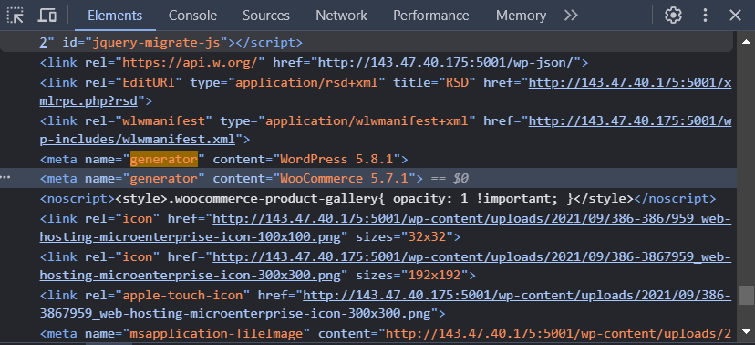
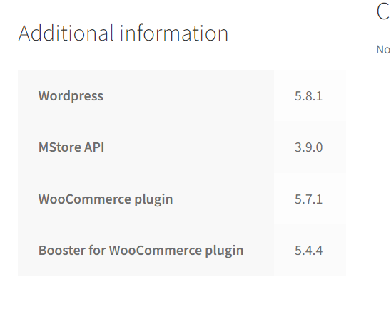
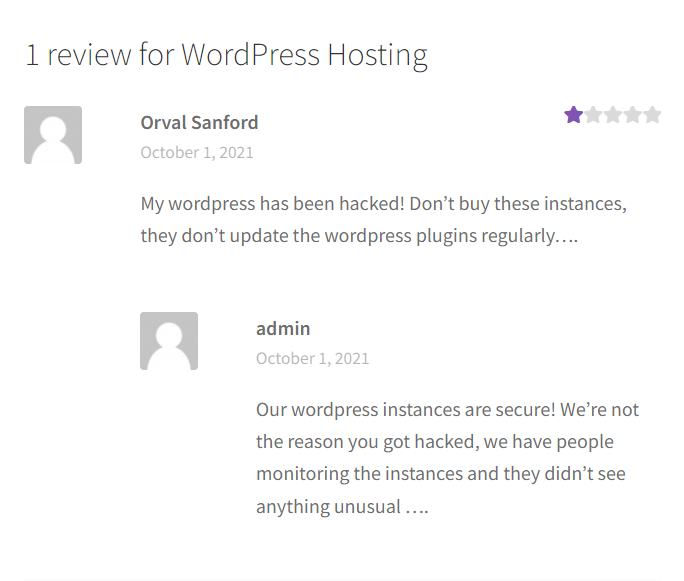

# CTF Semana 3 (WordPress CVE)

## Reconhecimento

- **Versão do wordpress**: Pensamento inicial, verificar no código html da página web informação pertinente (ctrl+shift+i). Foi encontrado através da keyword "generator" as versões do WordPress e do plugin Woocommerce sendo elas 5.8.1 e 5.7.1, respectivamente.
 
- **Plugins instalados e versões dos mesmos**: Tal como foi referido no tópico acima foi encontrado o plugin Woocommerce através da inspeção do website. Sentimos que estavamos num bom caminho, no entanto, ainda nos faltava algo. Foi daí que ao explorar melhor as janelas da web encontramos na tab "Additional information" do item "WordPress Hosting" toda a informação acerca das versões!

  
- **Possíveis utilizadores e nomes de utilizadores**: No que toca aos utilizadores deste sistema, deparamo-nos com dois comentários, o comentário do user "Orval Sanford" e o do "admin". Com base nesta informação, deduzimos que talvez seria possivel infiltramo-nos na conta de um destes users.

## Pesquisa por Vulnerabilidades

- **Procura de CVE's**: Após a recolha de informação passamos à fase de procura de CVE's. Primeiramente, focamo-nos em procurar nos sites recomendados do "Guião da Semana #2", onde fomos ao encontro de exploits que foram encontrados e ainda funcionam nas versões do WordPress, Woocommerce, Booster e MStore API referidas na imagem 3.

## Escolha da Vulnerabilidade

Desta pesquisa selecionamos o CVE-2022-21661 que se trata de uma descarga má gerida em WP_Query, o que pode abrir caminho para uma SQL injection através dos plugins ou temas 

## Referências

[^1]: (nome do website)[website]