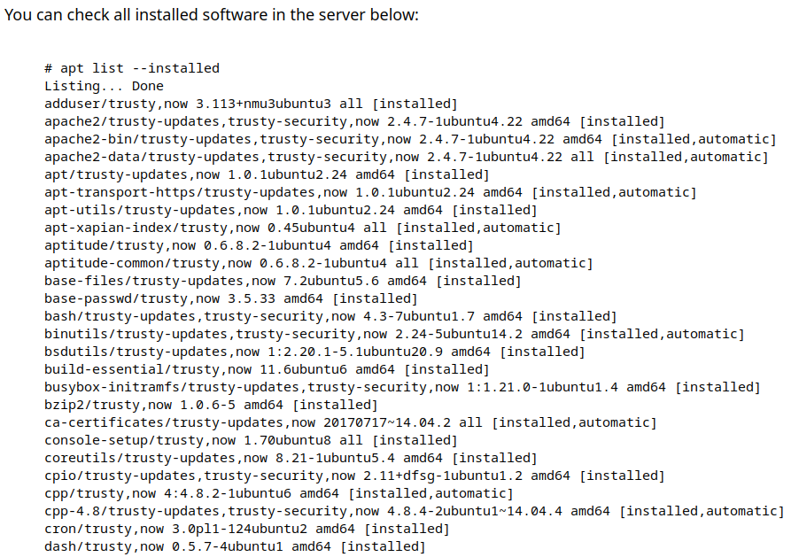
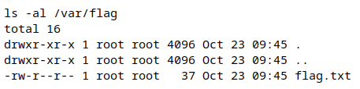
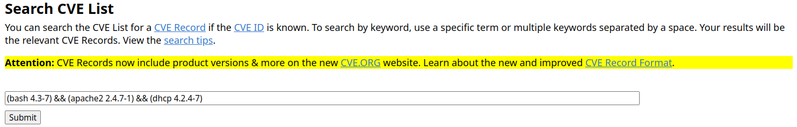
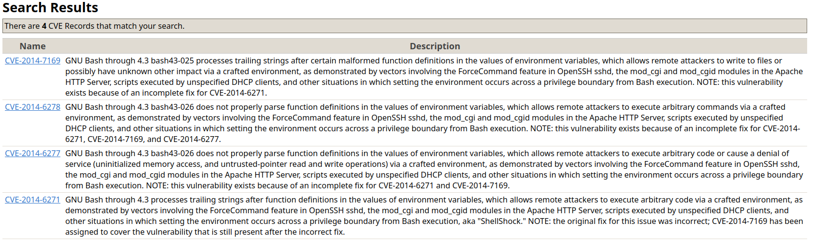
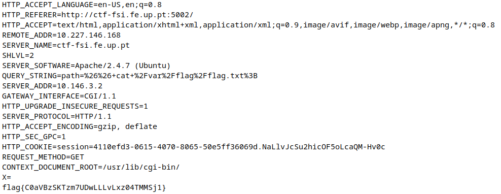

# CTF Semana 4 (Environment Variables)

## Reconhecimento

### Dependências

O primeiro passo que optamos por tomar foi a procura de caracteristicas do sistema, para tal, analisamos a informação resultante de `apt list --installed` que se encontrava presente.

Conseguimos destacar as seguintes caracteristicas:

- bash 4.3-7
- apache2 2.4.7-1
- dhcp 4.2.4-7

### Funcionalidades

Também procuramos entender o funcionamento da plataforma, e o modo de funcionamento da caixa de input.
Percebemos que o nosso input era adicionado ao comando `ls -al`, o que utilizamos inicialmente a nosso favor de modo a encontrar a localização da `flag` dentro do sistema:

## Pesquisa de vulnerabilidades

Após indentificadas as dependências do sistema, decidimos procurar por vulnerabilidades já conhecidas. Para tal introduzimos os dados recolhidos em [CVE Mitre](https://cve.mitre.org/) da seguinte forma:

Obtendo:

Com base nos CVEs encontrados, optamos por analisar o **CVE-2014-6278**, uma vez que foi a tentativa falhada/incompleta mais recente para a vulnerabilidade descrita.

Esta consiste num parse mal executado nas definições das funções dos valores das variáveis de ambiente, o que permite atacar remotamente, através de um ambiente alterado/construído, permitindo a execução de qualquer comando malicioso.

## Procura pela Flag

Com base nos conhecimentos adquiridos com a resolução do **LOGBOOK4** apercebemo-nos que, como o input do utilizador é imediatamente adicionado ao comando `ls` seria possível encadear outro comando com a utilização de `&&` ou `;`.

Como já sabiamos a localização da flag, foi simples ver o seu conteúdo:

Concluímos assim que o valor da flag: `flag{C0aVBzSKTzm7UDwLLLvLxz04TMMSj1}`

