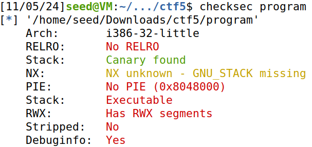
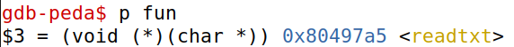
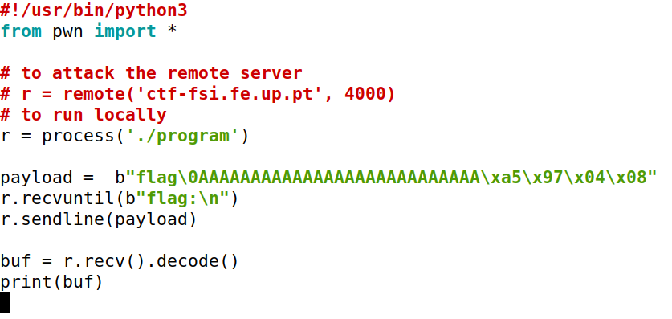
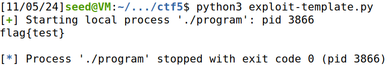
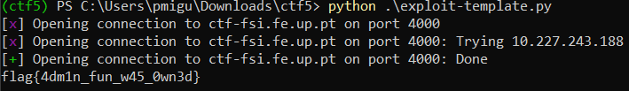

# CTF Semana 5 (Buffer-Overflow Attack Lab - Set-UID Version)

## Configuração do ambiente

De forma a facilitar o exploit a ser executado e seguindo as instruções do guião, executamos os seguintes comandos.

```bash
echo 'export PATH="$HOME/.local/bin:$PATH"' >> .bashrc
python3 -m pip install --upgrade pwntools

sudo apt update
sudo apt install checksec
```

## Contexto do problema

O objetivo deste `CTF` é explorar uma vulnerabilidade em um programa executado num servidor remoto, que permite obter a flag armazenada no ficheiro `flag.txt` na working directory. Para isso, o desafio disponibiliza vários recursos no ZIP dado.


## Tarefas

Primeiramente, é nos indicado correr o seguinte comando:



A partir deste, ficamos a entender várias informações do executável,sendo a mais pertinente ,neste caso, é a arquitetura do próprio, sendo esta de `x86` mas utiliza `32 bits`. Como tal, é nos sugerido executar o seguinte comando, visto que a nossa máquina é de `64 bits`.

```bash
sudo apt install gcc-multilib
```

De seguida, passamos às questões fornecidas do guião.

- **Existe algum ficheiro que é aberto e lido pelo programa?**: Sim ao executar o programa, este utiliza a função `readtxt` para ler o `rules.txt`.

- **Existe alguma forma de controlar o ficheiro que é aberto?**:Sim, caso consigamos passar `flag` como argumento da função podemos abrir o ficheiro alvo.

- **Existe algum buffer-overflow? Se sim, o que é que podes fazer?**: Sim, como o programa espera pelo input de 45 bytes do utilizador, e guarda o input num buffer com 32 bytes de espaço, caso o nosso input seja mais ou igual a 32 characteres ocorre `Segmentation fault`. Através deste overflow, podemos mudar para onde a função `fun` aponta e executar o `readtxt` em vez do `echo`.

## Execução do Ataque

Antes de começarmos a definir o exploit de python, precisamos de saber a posição de memória da função `readtxt`. Para isso, fazemos debug do executável, correndo os seguintes comandos.

```bash
gdb ./program # comando de debug

gdb-peda$ b main # adicionamos um break point na main
gdb-peda$ run
gdb-peda$ next # vamos executando vários next 
gdb-peda$ p fun # após ser fun=&readtxt ser executado, corremos este comando
```



Agora que temos a posição de memória do `readtxt`, podemos criar o modificar a payload do nosso script.

Ficheiro exploit: 



A criação da payload foi feita com as seguintes ideias em mente:

- Temos a `flag\0` que vai ser passada como argumento da função `readtxt`, com o objectivo de lermos o ficheiro `flag.txt`.

- Como tal, para isso acontecer, provocamos um buffer overflow ao preencher o resto do buffer com `A's`, neste caso 27 visto que buffer_size = 32, `flag\0` preenche 5 bytes, ou seja, 32 - 5 = 27 .

- Sendo assim, ao ocorrer esse erro fazemos com que o apontador de `fun` esteja a ser subscrito pelo endereço de memória do `readtxt` (introduzido em little endium).  

Agora executamos o script e obtemos a flag:

- Execução local:


- Execução remota:
