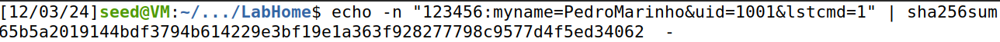
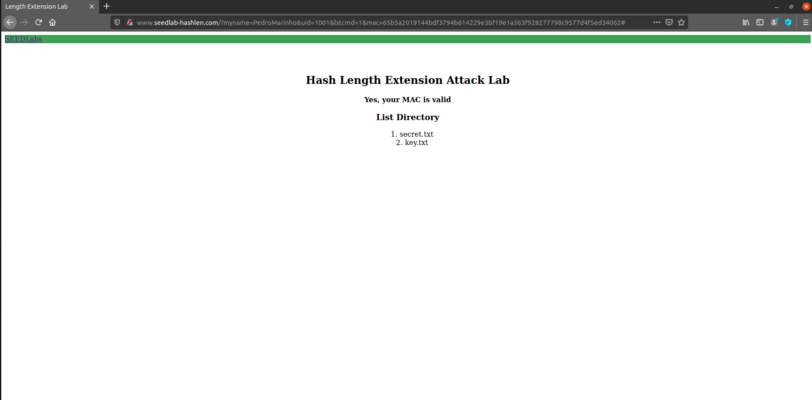
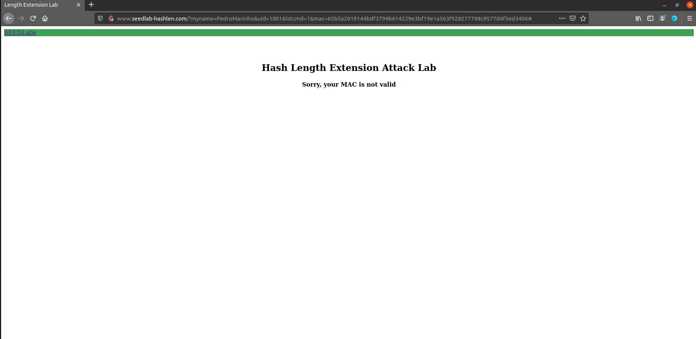
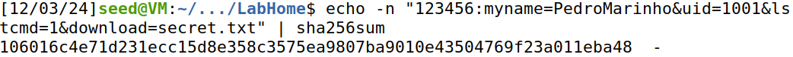
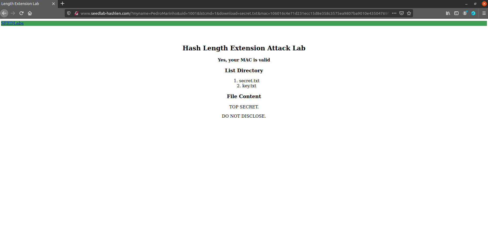
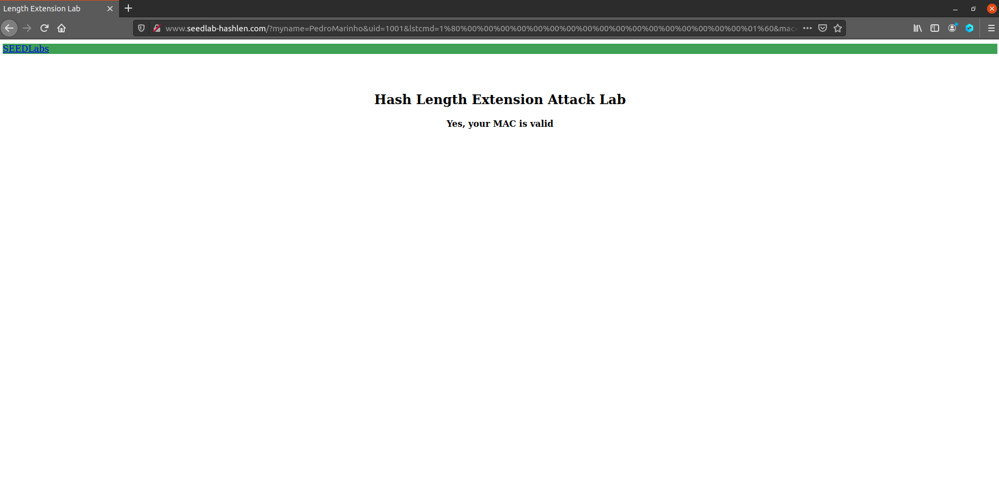
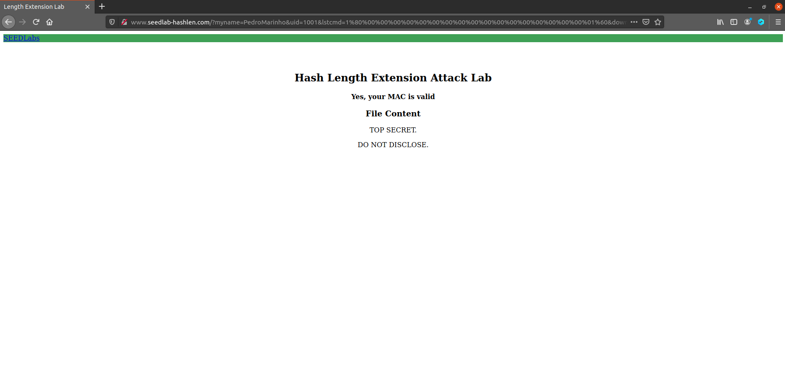

# Trabalho realizado na Semana #10

## Tarefa 1

Nesta secção o objetivo desta tarefa será mandar um _request_ malicioso, verificando a resposta dada pelo servidor `www.seedlab-hashlen.com`. Para tal, temos de adicionar este ao ficheiro `/etc/hosts`, de modo a ser reconhecido pela VM.

Sendo assim, agora iremos construir o nosso request através da escolha do primeiro e último nome de um dos membros do grupo e a **chave** com o seu respectivo **UID** que será selecionada a partir do ficheiro `key.txt`.

Dados escolhidos: `Key:R = 123456:myname=PedroMarinho&uid=1001&lstcmd=1`

Agora apenas necessitamos de calcular o `MAC`, executando o seguinte comando:



Como podemos observar obtemos o valor `65b5a2019144bdf3794b614229e3bf19e1a363f928277798c9577d4f5ed34062`

Deste modo, podemos agora fazer um _request_, visto que já temos toda a informação necessária.

Execução do request malicioso:
`http://www.seedlab-hashlen.com/?myname=PedroMarinho&uid=1001&lstcmd=1&mac=65b5a2019144bdf3794b614229e3bf19e1a363f928277798c9577d4f5ed34062`

Output do request: 



Neste caso, fomos bem sucedidos visto que tinhamos a informação correta, no entanto se tivessemos feito mal o calculo do **MAC** o resultado seria este:




Por fim, podemos ainda tentar fazer o _download_ do ficheiro secreto, `secret.txt`, e verificar se realmente o conseguimos obter.

**Novos Dados**: `Key:R = 123456:myname=PedroMarinho&uid=1001&lstcmd=1&download=secret.txt`

**Cálculo do novo mac**: 

Comando a executar `echo -n "123456:myname=PedroMarinho&uid=1001&lstcmd=1&download=secret.txt" | sha256sum`.



_Ouput_ do comando: `106016c4e71d231ecc15d8e358c3575ea9807ba9010e43504769f23a011eba48`

_Request_ a ser executado: `http://www.seedlab-hashlen.com/?myname=PedroMarinho&uid=1001&lstcmd=1&download=secret.txt&mac=106016c4e71d231ecc15d8e358c3575ea9807ba9010e43504769f23a011eba48`

Output do _request_:



Como podemos verificar, fomos bem sucedidos em buscar o ficheiro `secret.txt` e o seu conteúdo.

## Tarefa 2

Agora o nosso objetivo será criar um padding para a mensagem `123456:myname=PedroMarinho&uid=1001&lstcmd=1`.

A partir da explicação do guião, será necessário verficar o tamanho da nossa mensagem, sendo esta de 44 _bytes_, de modo a saber o padding, que será `64 - 44 = 20` bytes, e o número de total de bits `44 * 8 = 352 = 0x160`.

Com esta informação, podemos agora criar a **mensagem com o seu respetivo padding**:

```
"123456:myname=PedroMarinho&uid=1001&lstcmd=1"
"\x80"
"\x00\x00\x00\x00\x00\x00\x00\x00\x00\x00"
"\x00\x00\x00\x00\x00\x00\x00\x01\x60"
```

Não esquecer que os `\x` têm de ser substituídos por `%` na execução do **URL**.

Tendo agora o padding temos de recalcular o `MAC`.

Por algum motivo, o comando `sha256sum` não estava a calcular o `MAC` corretamente, o que levou à criação de um script auxiliar.

```python
import hashlib

# Input string
input_string = "123456:myname=PedroMarinho&uid=1001&lstcmd=1\x80\x00\x00\x00\x00\x00\x00\x00\x00\x00\x00\x00\x00\x00\x00\x00\x00\x00\x01\x60"

# Compute the SHA-256 hash
sha256_hash = hashlib.sha256(input_string.encode('latin1')).hexdigest()

# Output the SHA-256 hash
print(f"SHA-256 Hash: {sha256_hash}")
```


**Novo mac**: `9d97178af26b3a8e611f43a7d89aff6db8bf1c012f3ebe3ded0974721178d86b`

Executamos o seguinte `URL`: 

`http://www.seedlab-hashlen.com/?myname=PedroMarinho&uid=1001&lstcmd=1%80%00%00%00%00%00%00%00%00%00%00%00%00%00%00%00%00%00%01%60&mac=9d97178af26b3a8e611f43a7d89aff6db8bf1c012f3ebe3ded0974721178d86b`




Como podemos verificar fomos bem sucedidos.

## Tarefa 3

Nesta tarefa, teremos de criar o ficheiro `length_ext.c` e adaptá-lo de forma a conseguirmos executar uma nova mensagem, que neste caso será obter o ficheiro `secret.txt`. Para tal, vamos buscar o `MAC` da **task 1** e inserir neste script.

Script alterado:

```c
/* length_ext.c */
#include <stdio.h>
#include <arpa/inet.h>
#include <openssl/sha.h>
int main(int argc, const char *argv[])
{
    int i;
    unsigned char buffer[SHA256_DIGEST_LENGTH];
    SHA256_CTX c;

    SHA256_Init(&c);
    for(i=0; i<64; i++)
        SHA256_Update(&c, "*", 1);
        
    // MAC of the original message M (padded)
    c.h[0] = htole32(0x65b5a201);
    c.h[1] = htole32(0x9144bdf3);
    c.h[2] = htole32(0x794b6142);
    c.h[3] = htole32(0x29e3bf19);
    c.h[4] = htole32(0xe1a363f9);
    c.h[5] = htole32(0x28277798);
    c.h[6] = htole32(0xc9577d4f);
    c.h[7] = htole32(0x5ed34062);

    // Append additional message
    SHA256_Update(&c, "&download=secret.txt", 20);
    SHA256_Final(buffer, &c);

    for(i = 0; i < 32; i++) {
        printf("%02x", buffer[i]);
    }
    printf("\n");
    return 0;
}
```

De seguida, compilamos o programa e executámo-lo.


**Novo mac**:`898535c9f5d15194e62ed973381fdf0e698dffd601f04cd601f13875a14823e7`

**Url a ser executado**:
`http://www.seedlab-hashlen.com/?myname=PedroMarinho&uid=1001&lstcmd=1%80%00%00%00%00%00%00%00%00%00%00%00%00%00%00%00%00%00%01%60&download=secret.txt&mac=898535c9f5d15194e62ed973381fdf0e698dffd601f04cd601f13875a14823e7`



Verificamos assim, que realmente é possível revelar o conteúdo do ficheiro, mesmo sem a disponibilidade da chave.