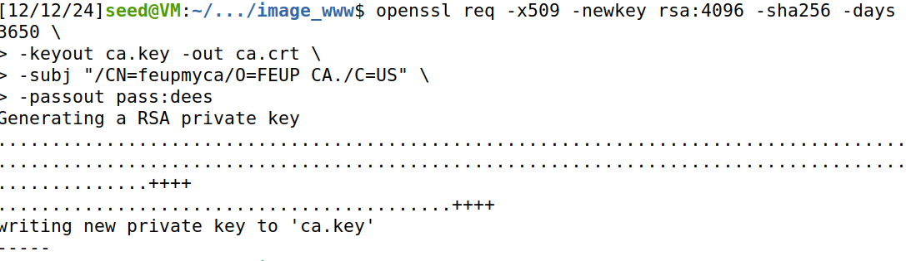
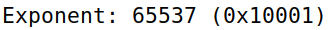
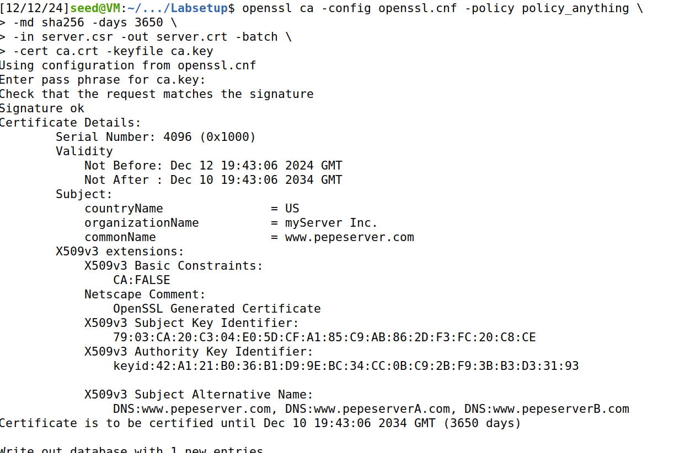
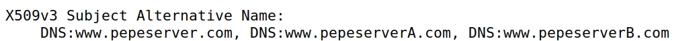
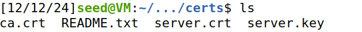
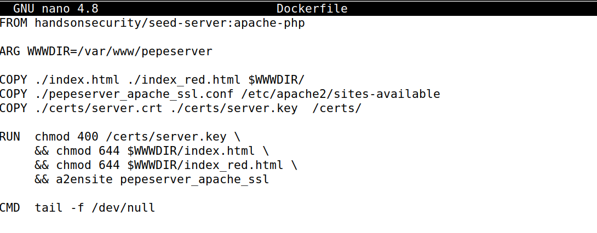
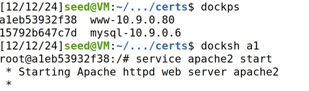
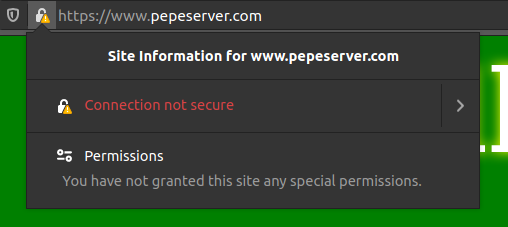
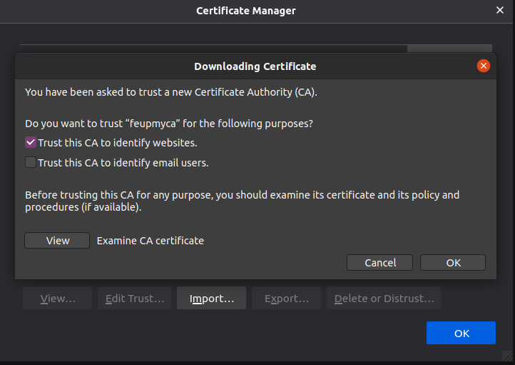
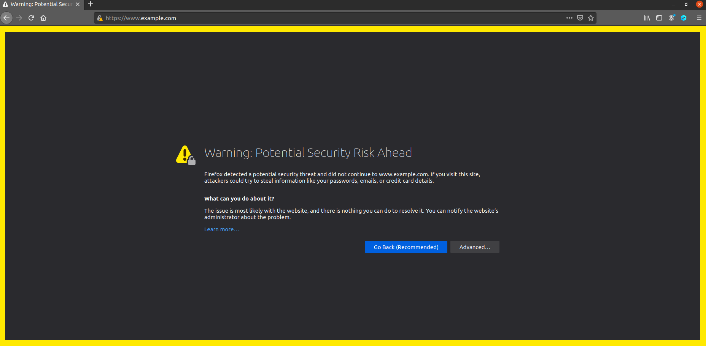

# Trabalho realizado na Semana #11

## Tarefa 1

Nesta tarefa é nos indicado criar um CA (Certificate Authority) para emitir certificados digitais. Sendo assim, começamos por copiar o ficheiro OpenSSL para a nossa diretoria.

```bash
cp /usr/lib/ssl/openssl.cnf .
```
Neste novo ficheiro, teremos de modificar a linha referente a `unique_subject`, descomentando-la.


De seguida, criamos o ficheiro vazio `index.txt` e `serial` com um número em string.

```bash
touch index.txt
echo 1000 > serial
```

Agora executamos o seguinte comando para criar o nosso certificado, passando já a informação da _password_ e o _suject_.

```bash
openssl req -x509 -newkey rsa:4096 -sha256 -days 3650 \
-keyout ca.key -out ca.crt \
-subj "/CN=www.modelCA.com/O=Model CA LTD./C=US" \
-passout pass:dees
```



Consequentemente, é nos pedido para correr os seguintes comandos e através do _output_
identificar o que é questionado em baixo:

```bash
# Comandos a ser executados
openssl x509 -in ca.crt -text -noout
openssl rsa -in ca.key -text -noout
```

**Qual parte do certificado indica que este é um certificado de uma Autoridade Certificadora (CA)?**

Nesta imagem, podemos verificar que no texto encontra-se `CA:TRUE`, o que indica que realmente é um Certificado de uma Autoridade Certificadora


**Qual parte do certificado indica que este é um certificado autoassinado?**

Nesta imagem, podemos verificar que como a `Subject Key Identifier` é igual à `Authority Key Identifier`, significa que fomos nós a criar o certificado.


**No algoritmo RSA, temos um expoente público e, um expoente privado d, um módulo n e dois números secretos p e q, de forma que n = pq. Por favor, identifique os valores desses elementos nos seus arquivos de certificado e chave.**

Módulo `n` do certificado:


Módulo `n` da chave:


Expoente público `e` do certificado:



Expoente público `e` da chave:


Expoente privado `d` da chave:


Número secreto `p` da chave: 


Número secreto `q` da chave: 


O valor do módulo `n` será equivalente a `p` * `q`.

## Tarefa 2

Esta tarefa tem o objetivo de criar um Request de Certificado para o nosso servidor.

Para tal executamos o comando para gerar CSR para `www.bank32.com`:

```bash
openssl req -newkey rsa:2048 -sha256 \
-keyout server.key -out server.csr \
-subj "/CN=www.bank32.com/O=Bank32 Inc./C=US" \
-passout pass:dees
```


Nós podemos utilizar os comandos já explorados na tarefa anterior para verificar o conteúdo descodificado.

```bash
openssl req -in server.csr -text -noout
openssl rsa -in server.key -text -noout
```

Seguidamente, vamos adicionar dois nomes alternativos para o login do request do certificado, para que o SAN esteja de ligado a esse mesmo.

```bash
openssl req -newkey rsa:2048 -sha256 \
-keyout server.key -out server.csr \
-subj "/CN=www.bank32.com/O=Bank32 Inc./C=US" \
-passout pass:dees -addext "subjectAltName = DNS:www.bank32.com, \
DNS:www.bank32A.com, \
DNS:www.bank32B.com"
```


## Tarefa 3

Nesta tarefa, teremos de gerar um certificado para o servidor.

Para tal vamos executar o seguinte comando:

```bash
openssl ca -config openssl.cnf -policy policy_anything \
-md sha256 -days 3650 \
-in server.csr -out server.crt -batch \
-cert ca.crt -keyfile ca.key
```



Seguidamente, temos de descomentar no nosso ficheiro `openssl.cnf` a linha `copy_extensions = copy`.

Agora corremos o seguinte comando para verificar se os nomes alternativos são incluídos:

```bash
openssl x509 -in server.crt -text -noout
```
Podemos ver que temos o que queriamos:



## Tarefa 4

Após sabermos as bases de como criar um Certificado de Autoridade, nesta tarefa iremos dar _setup_ do site `www.bank32.com` através de um server `Apache`.

Para tal, precisamos de garantir que o ficheiro `Dockerfile` está corretamente configurado, assim como, `bank32_apache_ssl.conf` e, a informação do certificado está na diretoria correta.






Como podemos observar, neste lab, todas as configurações já veem corretamente configuradas.

Sendo assim, agora vamos abrir o container com o comando `dcup` e ,seguidamente, acedemos à shell do container aberto através dos comandos `dockps e docksh <id>`, e por fim corremos o comando `service apache2 start`, para abrir o servidor:



Podemos verificar que quando abrimos o servidor com o link http://www.bank32.com, temos uma tela vermelha.


E quando abrimos o servidor com o link https://www.bank32.com, temos uma tela verde.


Este comportamento é normal, uma vez que foi designado no ficheiro de configuração do servidor. No entanto, ao navegar pelo site via HTTPS, o navegador alerta-nos de que a ligação ao site não é segura.



Para resolver este problema, temos de ir às `preferences` do firefox e ir à secção dos certificados. Aí, iremos adicionar o ficheiro `modelCA.crt` visto que é a chave pública que "assinou" o `bank32.crt`.



Após dar refresh ao firefox, a nossa conexão será totalmente segura:


## Tarefa 5

Nesta tarefa, vamos fazer utilizar o nosso servidor a partir do acesso do site `www.example.com`. Quando um utilizador visitar o site `www.example.com`, ele será redirecionado para o nosso `www.example.com`, que está alojado num IP diferente do original. 

Sendo assim, o primeiro passo será adicionar uma nova entrada no VirtualHost ao ficheiro /etc/apache2/sites-available/bank32_apache_ssl.conf:

```
<VirtualHost *:443>
    DocumentRoot /var/www/bank32
    ServerName www.example.com
    DirectoryIndex index.html
    SSLEngine On
    SSLCertificateFile /certs/bank32.crt
    SSLCertificateKeyFile /certs/bank32.key
</VirtualHost>
```

De seguida adicionamos o DNS do servidor no ficheiro `/etc/hosts`:
`10.9.0.80    www.example.com`

Ao acedermos ao site `www.example.com`, como estamos a usar o mesmo certificado que em `www.bank32.com`, o navegador avisa-nos de que este certificado não é para `www.example.com`, comparando o URL visitado com o Common Name apresentado no certificado. Podemos ver esse aviso na imagem seguinte:



## Tarefa 6

Nesta tarefa, vamos assumir que a CA raiz criada na Tarefa 1 foi comprometida por um atacante, e a sua chave privada foi roubada. Com isso, o nós conseguimos gerar qualquer certificado arbitrário usando a chave privada dessa CA. 

Tendo em atenção a tarefa 5, vamos "substituir" o nosso servidor pelo `www.example.com`, adicionando à entrada


Sendo assim, primeiramente havemos de criar um novo certificado através do comando:

```bash
openssl req -newkey rsa:2048 -sha256  \
-keyout newca.key -out newca.csr  \
-subj "/CN=www.website.com/O=website CA./C=US" \
-passout pass:dees
```

Agora vamos criar um certificado para o servidor.

```bash
openssl ca -config openssl.cnf -policy policy_anything \
-md sha256 -days 3650 \
-in newca.csr -out newca.crt -batch \
-cert ca.crt -keyfile ca.key
```