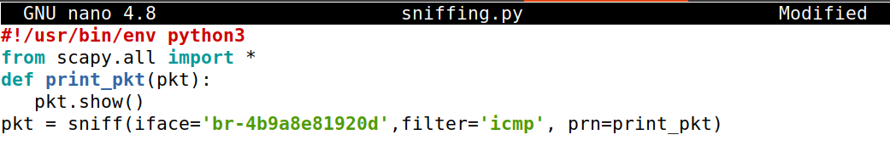
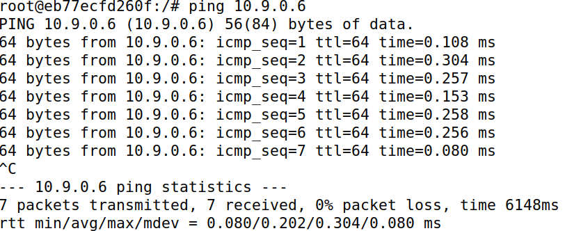
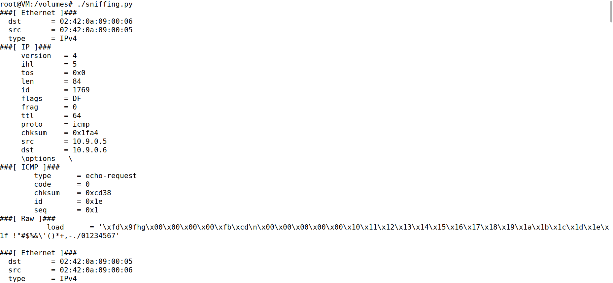
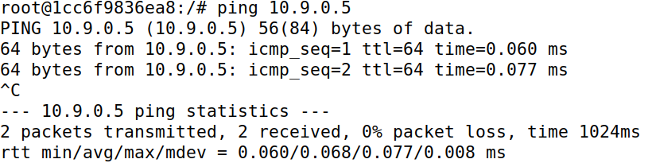
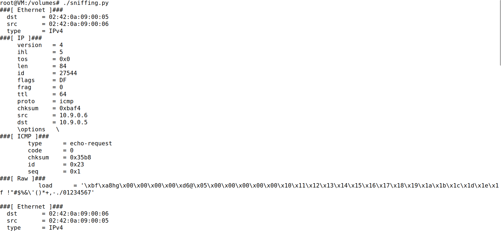
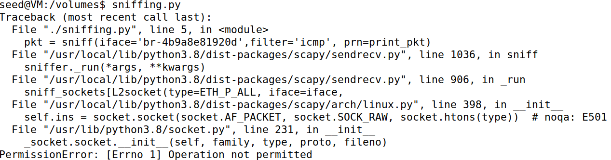
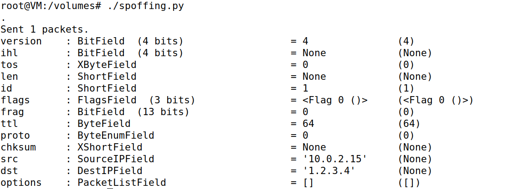
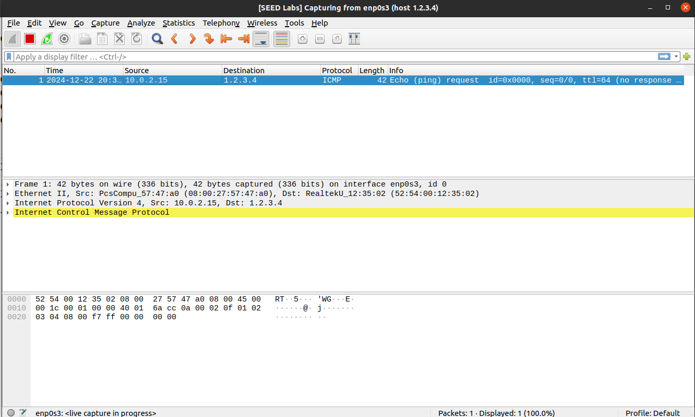

# Trabalho realizado na Semana #13

# Tarefa 1.1.A

Nesta tarefa vamos aprender a utilizar o Scapy para capturar e analisar pacotes de rede em programas de _Python_, de forma a realizar tarefas de sniffing.

Sendo assim, para sabermos que interface temos de dar _sniff_, corremos na root da shell do container `seed-attacker` o comando `ifconfig` e conseguimos obter a interface alvo, sendo `br-4b9a8e81920d`.
Como tal, o nosso script de _python_ vai ter este aspeto:



De seguida corremos os seguintes comandos recomendados pelo guião:

```bash

// Make the program executable
# chmod a+x sniffing.py
// Run the program with the root privilege
# sniffing.py
// Switch to the "seed" account, and
// run the program without the root privilege
# su seed
$ sniffing.py

```

Quando corremos o comando com a _root privielege_ conseguimos capturar os seguintes pacotes, após corrermos `ping 10.9.0.6` do `hostA-hostB` e `ping 10.9.0.5` do `hostB-hostA`:

Ping hostA-hostB:



Pacotes capturados:



Ping hostB-hostA:



Pacotes capturados:



Conseguimos capturar os pacotes de comunicação entre o servidor hostA e hostB:

Exemplo de um pacote capturado através do hostA para o hostB é o seguinte:

```
###[ Ethernet ]### 
  dst       = 02:42:0a:09:00:06
  src       = 02:42:0a:09:00:05
  type      = IPv4
###[ IP ]### 
     version   = 4
     ihl       = 5
     tos       = 0x0
     len       = 84
     id        = 2678
     flags     = DF
     frag      = 0
     ttl       = 64
     proto     = icmp
     chksum    = 0x1c17
     src       = 10.9.0.5
     dst       = 10.9.0.6
     \options   \
###[ ICMP ]### 
        type      = echo-request
        code      = 0
        chksum    = 0xae30
        id        = 0x20
        seq       = 0x1
###[ Raw ]### 
           load      = 'G\xa7hg\x00\x00\x00\x00\xd1\xcc\t\x00\x00\x00\x00\x00\x10\x11\x12\x13\x14\x15\x16\x17\x18\x19\x1a\x1b\x1c\x1d\x1e\x1f !"#$%&\'()*+,-./01234567'
```

**Camada Ethernet (Enlace)**
Esta é a camada de enlace no modelo OSI, responsável por mover os pacotes na rede local (LAN).

- **dst**: 02:42:0a:09:00:06 - Endereço MAC de destino, correspondente ao hostB.
- **src**: 02:42:0a:09:00:05 - Endereço MAC de origem, correspondente ao hostA.
- **type**: IPv4 - Indica que o pacote contém dados de protocolo IPv4 na camada superior.
  
**Camada IP (Rede)**

A camada IP lida com o endereçamento lógico e o roteamento do pacote entre redes diferentes.

- **version**: 4 - Indica que o pacote usa o protocolo IPv4.
- **src**: 10.9.0.5 - Endereço IP de origem, representando o hostA.
- **dst**: 10.9.0.6 - Endereço IP de destino, representando o hostB.
- **len**: 84 - Comprimento total do pacote (em bytes), incluindo cabeçalhos e dados.
- **proto**: icmp - Protocolo de camada superior, neste caso ICMP.
- **ttl**: 64 - Tempo de vida (Time To Live), número de saltos permitidos antes que o pacote seja descartado.
- **chksum**: 0x1c17 - Soma de verificação para garantir a integridade do cabeçalho IP.
- 
**Camada ICMP (Transporte)**

O ICMP é usado para mensagens de controlo, como o envio de pings para diagnóstico de redes.

- **type**: echo-request - Tipo de mensagem ICMP que solicita uma resposta (usado pelo comando ping).
- **seq**: 0x1 - Número de sequência do pacote, utilizado para rastreamento.
- **chksum**: 0xae30 - Soma de verificação do cabeçalho ICMP para garantir a integridade.
- 
**Camada Raw (Aplicação)**
Esta camada contém os dados brutos ou payload que são transportados dentro do pacote.

- **load**: Contém uma sequência de bytes que inclui padrões de teste e informações adicionais usadas pelo comando ping. Este payload é frequentemente usado para verificar a consistência e o comportamento dos pacotes durante o envio e recepção.


Agora vamos correr o comando sem _root privielege_:



Sem _root privielege_ não é possível correr o script devido a falta de permissões.


# Tarefa 1.1.B

- Para capturar apenas os pacotes `ICMP` temos apenas de aplicar o seguinte filtro:

`pkt = sniff(iface='br-4b9a8e81920d',filter='icmp', prn=print_pkt)`

Este método já foi utilizado na tarefa anterior.

- Para capturar qualquer pacote TCP que vem de um IP específico na porta 23 teremos de modificar o script da seguinte forma:

```python

#!/usr/bin/env python3
from scapy.all import *
def print_pkt(pkt):
   pkt.show()
pkt = sniff(iface='br-4b9a8e81920d',filter='tcp && src host 10.9.0.6 && dst port 23', prn=print_pkt)
```

Neste caso vamos capturar os pacotes que vêm do host com ip `10.9.0.6` na porta 23. 
Sendo assim, para vermos que realmente está a funcionar a partir da shell do hostB corremos o comando `telnet 10.9.0.5`.

Exemplo de um pacote tcp `sniffed`:

```
###[ Ethernet ]### 
  dst       = 02:42:0a:09:00:05
  src       = 02:42:0a:09:00:06
  type      = IPv4
###[ IP ]### 
     version   = 4
     ihl       = 5
     tos       = 0x10
     len       = 60
     id        = 21359
     flags     = DF
     frag      = 0
     ttl       = 64
     proto     = tcp
     chksum    = 0xd320
     src       = 10.9.0.6
     dst       = 10.9.0.5
     \options   \
###[ TCP ]### 
        sport     = 44460
        dport     = telnet
        seq       = 3000744790
        ack       = 0
        dataofs   = 10
        reserved  = 0
        flags     = S
        window    = 64240
        chksum    = 0x144b
        urgptr    = 0
        options   = [('MSS', 1460), ('SAckOK', b''), ('Timestamp', (394071517, 0)), ('NOP', None), ('WScale', 7)]
```

- Para capturar pacotes que vêm ou vão para uma subnet específica, tendo neste caso escolhido a `128.230.0.0/16`, mudamos o nosso script para o seguinte:

```python

#!/usr/bin/env python3
from scapy.all import *
def print_pkt(pkt):
   pkt.show()
pkt = sniff(iface='br-4b9a8e81920d',filter='net 128.230.0.0/16', prn=print_pkt)

```

Se dermos `ping 128.230.0.7` (ou qualquer outro válido), conseguimos captar os pacotes seguintes:

```
###[ Ethernet ]### 
  dst       = 02:42:02:5a:e3:e4
  src       = 02:42:0a:09:00:06
  type      = IPv4
###[ IP ]### 
     version   = 4
     ihl       = 5
     tos       = 0x0
     len       = 84
     id        = 28718
     flags     = DF
     frag      = 0
     ttl       = 64
     proto     = icmp
     chksum    = 0x3f7f
     src       = 10.9.0.6
     dst       = 128.230.0.7
     \options   \
###[ ICMP ]### 
        type      = echo-request
        code      = 0
        chksum    = 0xadf9
        id        = 0x28
        seq       = 0x1
###[ Raw ]### 
           load      = '\xd0\xb2hg\x00\x00\x00\x00H\xf0\t\x00\x00\x00\x00\x00\x10\x11\x12\x13\x14\x15\x16\x17\x18\x19\x1a\x1b\x1c\x1d\x1e\x1f !"#$%&\'()*+,-./01234567'

###[ Ethernet ]### 
  dst       = 02:42:02:5a:e3:e4
  src       = 02:42:0a:09:00:06
  type      = IPv4
###[ IP ]### 
     version   = 4
     ihl       = 5
     tos       = 0x0
     len       = 84
     id        = 28944
     flags     = DF
     frag      = 0
     ttl       = 64
     proto     = icmp
     chksum    = 0x3e9d
     src       = 10.9.0.6
     dst       = 128.230.0.7
     \options   \
###[ ICMP ]### 
        type      = echo-request
        code      = 0
        chksum    = 0x5286
        id        = 0x28
        seq       = 0x2
###[ Raw ]### 
           load      = '\xd1\xb2hg\x00\x00\x00\x00\xa2b\n\x00\x00\x00\x00\x00\x10\x11\x12\x13\x14\x15\x16\x17\x18\x19\x1a\x1b\x1c\x1d\x1e\x1f !"#$%&\'()*+,-./01234567'

```

# Tarefa 1.2

Para executar esta tarefa, criamos o ficheiro `spoffing.py` para dar `spoof` a pacotes IP com um endereço de IP aleatório. 

Script criado:
```python
#!/usr/bin/env python3
from scapy.all import *
a = IP() 
a.dst = '1.2.3.4' 
b = ICMP() 
p = a/b
 
send(p)

ls(a)

```

Para correr o script, temos de mais uma vez correr o comando `chmod a+x spoffing.py`, para torná-lo num executável.

Execução do script:



E no wireshark fazemos uma captura a partir do `enp0s3` para o `host 1.2.3.4`.



Através do wireshark, conseguimos verificar que conseguimos enviar com sucesso o pacote.


# Tarefa 1.3