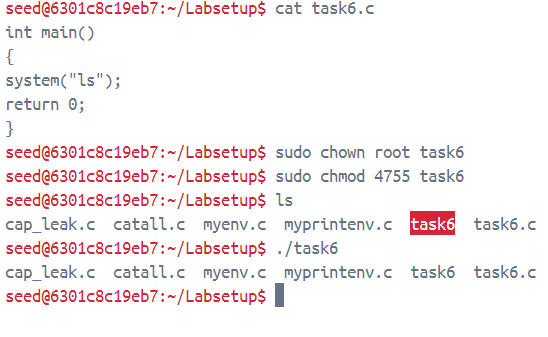
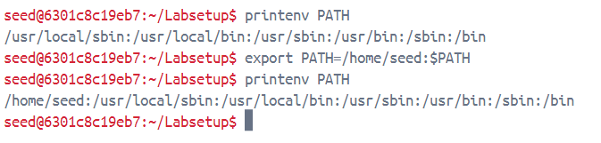
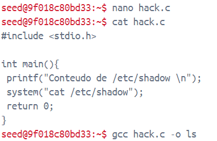
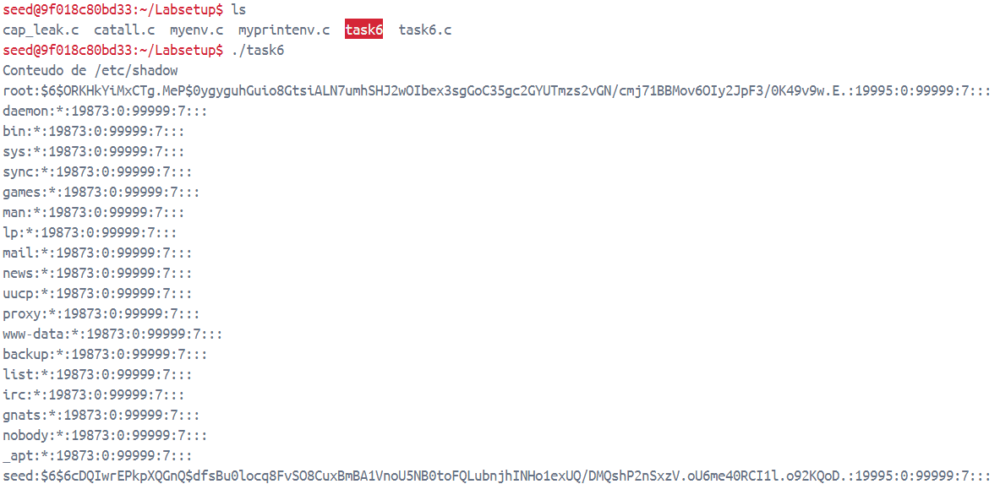
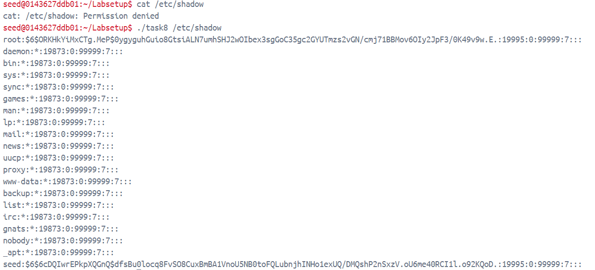
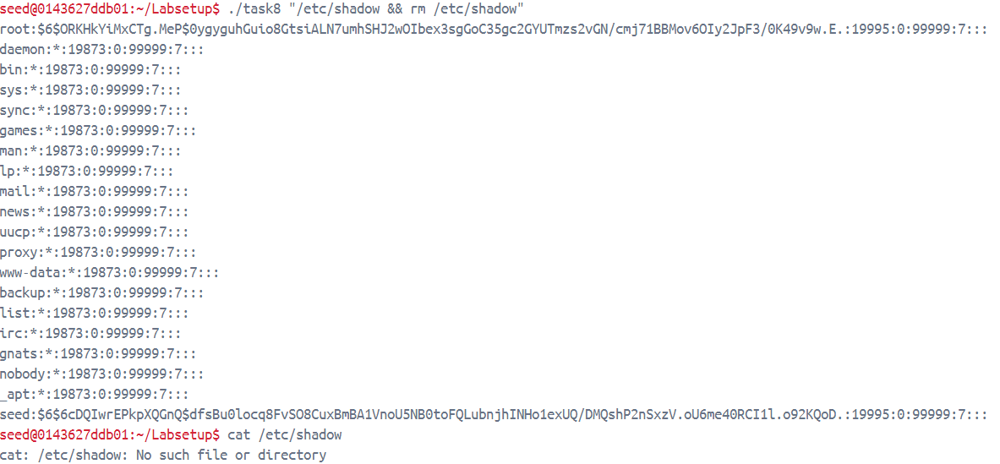

# Trabalho realizado na Semana #4

## Tarefa 1: Manipulating Environment Variables

- **Utilização de printenv/env**: Como podemos verificar ao utilizar o comando printenv ou env, de facto, mostra-nos no terminal todas as variáveis de ambiente.

- **Utilização de export/unset**: Como indicado, utilizamos os dois comandos e conseguimos definir novas variáveis de ambiente com um valor específico,assim como remover variáveis já existentes:

```bash
seed@VM:~$ printenv test
seed@VM:~$ export test=testValue
seed@VM:~$ printenv test
testValue
seed@VM:~$ unset test
seed@VM:~$ printenv test
seed@VM:~$ 
```

## Tarefa 2: Passing Environment Variables from Parent Process to Child Process

- Após correr o código indicado verificamos que de facto não existia nenhuma diferença entre as variáveis de ambiente do processo filho e do processo pai. Desta forma podemos concluir que o processo filho, criado a partir da função `fork`, herda todas as variáveis de ambiente.

## Tarefa 3: Environment Variables and `execve()`

Respondendo à questão "As variáveis de ambiente são herdadas automaticamente pelo novo programa?"

- Não. Quando corremos o programa com o terceiro parâmetro de `execve` (`envp`) como `NULL` o ambiente (o conjunto de variáveis de ambiente ) do novo programa vai ser vazio.

- Como é esclarecido no `man execve`: `envp` é um array de strings, com o formato convencional **key=value**, que são passadas como um ambiente para o novo programa. O `argv` e `envp` arrays são obrigados a ter um apontador nulo no final do array.

- Então, as novas variáveis de ambiente do programa têm de ser passadas no argumento `envp` do comando `execve`. Para tal, a utilização da variável `environ` é conveniente visto que aponta para um array de apontadores de strings, denominado de "environment", que guarda o valor de cada uma das variáveis de ambiente.

- Apesar disso, uma destas variáveis muda, a variável `_`. Isto é normal uma vez que esta guarda o último argumento do comando anteriormente executado

## Tarefa 4: Environment Variables and `system()`

- Depois de corrermos o código fornecido verificamos que, através da comparação com as variáveis de ambiente antes da execução do mesmo, de facto, estas se mantêm (apesar de não necessariamente com a mesma ordem)

## Tarefa 5: Environment Variable and Set-UID Programs

- Com a execução dos passos referidos conseguimos perceber que nem todas as variáveis de ambiente no processo pai são transferidas para o processo `SET-UID` filho.

- De facto, este é um processo natural. As variáveis de ambiente mais cruciais, como `LD_LIBRARY_PATH` (aquelas que se maliciosamente alteradas teriam facilmente um impacto negativo) são filtradas ou alteradas de formas a proteger o sistema.

- Estranhamente `PATH` não apresenta o mesmo tipo de cuidado que `LD_LIBRARY_PATH` o que pode se mostrar uma vulnerabilidade.

## Tarefa 6: The PATH Environment Variable and Set-UID Programs

### Passo 1 - Criação do programa SET-UID

- Criamos um programa em C com o conteúdo indicado no guia. Executar o comando `ls`

- Mudámos as permissões e o dono do mesmo de forma a torná-lo um programa SET-UID

<div style="text-align: center;">
    
</div>


- Como pudemos ver pelo resultado do executável `task6`, as permissões do processo são alteradas, retornando-as às do nosso utilizador. Como referido no guião, tal mecanismo de proteção está implementado em `/bin/dash` ao qual `/bin/sh` está ligado

### Passo 2 - Mudar a shell

- Para conseguirmos realmente executar o ataque sem proteções do género, ligamos `/bin/sh` a outra shell, que não possui essa proteção.

<div style="text-align: center;">
    
</div>


### Passo 3 - Modificar a variável de ambiente `PATH`

- Alterar a variável de ambiente `PATH` adicionando no seu início o caminho para a diretoria onde o executável `ls` estará presente (`home/seed`)
- Isto fará com que, quando executado o programa `ls` sem um caminho absoluto para o executável fidedigno, o sistema procure pelo mesmo primeiramente em `home/seed`. 

<div style="text-align: center;">
    
</div>


### Passo 4 - Criar o `ls` malicioso na localização adicionada ao `PATH`

- Optamos por simplesmente fazer este programa mostrar os conteúdos do ficheiro `/etc/shadow`. Um ficheiro com conteúdo sensível, que apenas pode ser acessado por utilizadores com a devida permissão.

<div style="text-align: center;">
    
</div>


### Passo 5 - Executar o programa SET_UID

- Assim que executámos o programa, os conteúdos do ficheiro `/etc/shadow` são mostrados no terminal
- O programa SET-UID tenta correr `ls` mas é direcionado ao executável malicioso. A leitura do ficheiro é possível uma vez que os privilégios do executável `task6` são as da `root`, por ser um ficheiro `SET-UID`.


<div style="text-align: center;">
    
</div>

# Tarefa 8: Invoking External Programs Using `system()` versus `execve()`

## Primeiro Passo

- Começamos por dar setup ao nosso programa, tornando-o um programa root `Set-UID`.

<div style="text-align: center;">
    
</div>

- Tendo feito isto, o nosso programa é capaz de correr um comando `cat` com privilégios.

<div style="text-align: center;">
    
</div>

- Como tal, podemos executar através do nosso programa, qualquer script malicioso, sendo neste caso a remoção de um ficheiro sem acesso de escrita.

<div style="text-align: center;">
    
</div>

