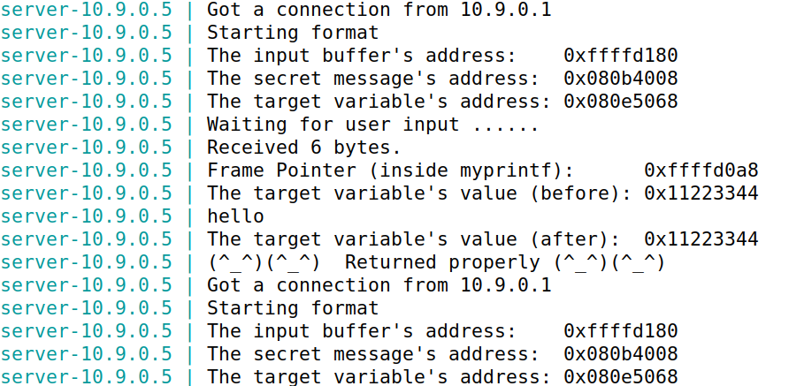
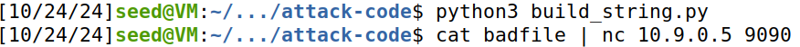
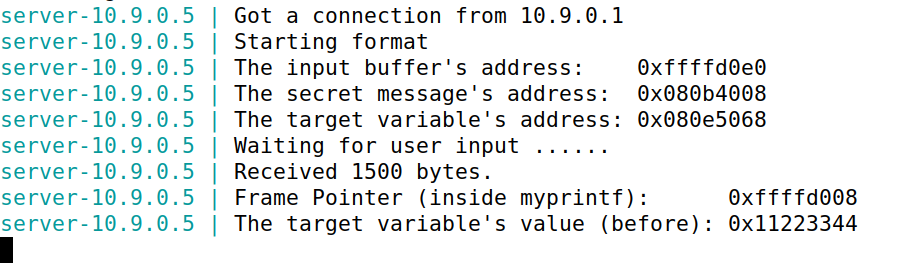

# Trabalho realizado na Semana #6


## Questão 1
### Configuração básica

- Como sugerido, executamos o seguinte comando, de forma a facilitar o acesso dos endereços de memória alvo, ao retirar o fator de alocação de memória aleatório.

```bash
$ sudo sysctl -w kernel.randomize_va_space=0
```
- Para além disso, é nos dito para configurar os containers do `docker` com o objectivo de criarmos um ambiente, neste caso um servidor, onde possamos testar os nossos exploits. Como tal, compilamos e instalamos o programa binário para o container, ao executar os comandos abaixo.

```bash
$ make
$ make install
```

- Por fim, são nos indicados os comandos necessários para manipular os containers e abrir o respectivo. Neste Lab, apenas vamos utilizar o container com o servidor 10.9.0.5.

```bash
$ docker-compose build # Build the container images
$ docker-compose up # Start the containers
$ docker-compose down # Shut down the containers

$ dockps # Get the ID's of the available containers
$ docksh <ID> # Get a shell inside the server

```  

### Tarefa 1 : Crashing the Program

- Após concluída a configuraçáo inicial, o nosso objetivo é _crashar_ o programa através da exploração da função `myprintf`, mas antes disso temos de verficar se o nosso container está a correr corretamente. Para isso, utilizamos duas shells, uma que verica as mensagens e a outra que executa os comandos.

Comando a ser executado:


Resposta do servidor:


- Sendo assim, para alcançar-mos o que nos foi pedido, analizamos o ficheiro de ataque `build_string.py`, recomendado pelo guião.
Resumidamente, este cria um ficheiro `badfile` com o tamanho do buffer e preenche-o, completamente, com `NOP's` e com vários exemplos de construção de strings.

- Dito isto, verificamos que, realmente, conseguiamos _crashar_ o programa através do format specifier `%n`, que guarda o valor dos bytes impressos pela função `printf` . Nesta situação, como não temos qualquer variável para guardar este valor, o programa vai guardá-lo na posição de memória do endereço acedido, fazendo com que o programa deixe de returnar corretamente.    

Para tal corremos o seguinte comando:


Resultado da execução do comando:


