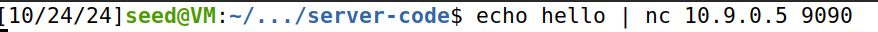

# Trabalho realizado na Semana #6


## Questão 1
### Configuração básica

- Como sugerido, executamos o seguinte comando, de forma a facilitar o acesso dos endereços de memória alvo, ao retirar o fator de alocação de memória aleatório.

```bash
$ sudo sysctl -w kernel.randomize_va_space=0
```
- Para além disso, é nos dito para configurar os containers do `docker` com o objectivo de criarmos um ambiente, neste caso um servidor, onde possamos testar os nossos exploits. Como tal, compilamos e instalamos o programa binário para o container, ao executar os comandos abaixo.

```bash
$ make
$ make install
```

- Por fim, são nos indicados os comandos necessários para manipular os containers e abrir o respectivo. Neste Lab, apenas vamos utilizar o container com o servidor 10.9.0.5.

```bash
$ docker-compose build # Build the container images
$ docker-compose up # Start the containers
$ docker-compose down # Shut down the containers

$ dockps # Get the ID's of the available containers
$ docksh <ID> # Get a shell inside the server

```  

### Tarefa 1 : Crashing the Program

- Após concluída a configuraçáo inicial, o nosso objetivo é _crashar_ o programa através da exploração da função `myprintf`, mas antes disso temos de verficar se o nosso container está a correr corretamente. Para isso, utilizamos duas shells, uma que verica as mensagens e a outra que executa os comandos.

Comando a ser executado:


Resposta do servidor:


- Sendo assim, para alcançar-mos o que nos foi pedido, analizamos o ficheiro de ataque `build_string.py`, recomendado pelo guião.
Resumidamente, este cria um ficheiro `badfile` com o tamanho do buffer e preenche-o, completamente, com `NOP's` e preenche o ínicio do buffer com vários exemplos de construção inputs.

- Dito isto, verificamos que, realmente, conseguimos _crashar_ o programa através do _format specifier_ `%n`, que guarda o valor dos bytes impressos pela função `printf` . Nesta situação, como não temos qualquer variável para guardar este valor, o programa vai guardá-lo na posição de memória do endereço acedido, fazendo com que o programa deixe de returnar corretamente.    

Para tal corremos o seguinte comando:


Resultado da execução do comando:


### Tarefa 2 : Printing Out the Server Program’s Memory

#### A : Stack Data

- Para encontrar o valor que colocámos no buffer, usamos o _format specifier_ `%x` para imprimir a stack e procurar esse valor. Basicamente, executamos o nosso exploit, que cria um ficheiro `badfile` e vamos ajustando o número de `%x` ao longo de várias execuções do programa, até encontrarmos o valor procurado na stack.

**No nosso caso, foram necessárias 64 impressões.**

Ficheiro do exploit utilizado:


_Output_ da mensagem do servidor:


Como podemos verificar o _output_ acima vem em _little endium_ / **0xeeeefffb** /

#### B : Heap Data

- Tendo em conta a task feita previamente, sabemos que a posição do nosso input inicial estará à distância de **256 bytes**(64 `%x`) do apontador do ínicio da stack. Sendo assim, podemos utilizar o _format specifier_ `%s`, após inserirmos 63 `%x`, para ler o que está dentro do endereço de memória da mensagem secreta **0x080b4008**.

Exploit utilizado:


Resultado do exploit:


Como podemos verificar conseguimos ler a mensagem **A secret message** do endereço de memória pretendido.


### Task 3: Modifying the Server Program’s Memory

#### A : Change the value to a different value

- Nesta tarefa, para mudarmos o valor **0x11223344**, do endereço de memória **0x080e5068**, para outro valor qualquer temos de fazer algo semelhante ao que já fizemos nas outras tarefas. Vamos percorrendo a stack com os `%x` até chegarmos ao endereço alvo. Neste caso, basta adicionar um `%n` no final e,sendo assim, modificamos o valor deste para o **número de caracteres** _printados_ antes desse _format specifier_.

_Exploit_ executado:


_Output_ do progama:


Podemos assim verificar que realmente mudamos com sucesso o valor do `target` através do seu endereço de memória.

#### B : Change the value to 0x5000

- Esta tarefa será algo do gênero da prévia, no entanto temos de mudá-la para um valor **específico**. Já é de nosso entender, que o `%n` mudifica um valor para o número de caracteres impressos. Sendo assim, podemos tirar vantagem disso e escrever o número necessário até obtermos o valor pretendido.

_Exploit_ executado:


_Output_ do programa:


Como podemos ver, vamos executando vários `%x` até chegarmos à penúltima posição antes do `target address` e fazemos o **ajuste** , ou seja, subtraímos o número de caracteres que seriam imprimidos até a posição 62 pelo valor alvo, neste caso 0x5000, obtendo assim o resto dos caracteres a serem impressos antes de mudar o valor do `target`.

## Questão 2

Respondendo à **primeira pergunta**: Não, não é necessário que a format string esteja alocada na stack para que a vulnerabilidade exista em CWE-134.

**Explicação**: O CWE-134 é um problema de segurança relacionado à utilização de _format strings_ não controladas. Como o código fornecido, permite-nos inserir uma _format string_ diretamente, através do printf(`badfile`), o ataque pode ocorrer independentemente de onde essa string está alocada. O importante é que a função printf leia e interprete os especificadores de formato (`%x`, `%s`, `%n`, etc.), sem validar a entrada.

A vantagem de as _format strings_ estarem alocadas na stack, apenas facilita o acesso e manipulação da memória que está mais próxima.

Respondendo à **segunda pergunta**: Das tarefas concretizadas, as Tarefas **3.A**, **3.B**, **3.C** são as que teriam uma grande taxa de insucesso sendo praticamente impossíveis de realizar.

**Explicação**: O sucesso de ataques de escrita, como em Tasks **3.A**, **3.B** e **3.C**, depende do cálculo preciso da posição da _format string_ em relação às variáveis-alvo na memória. Sendo assim, quando guardamos uma _format string_ na heap, comparadamente à stack o _layout_ de memória é menos previsível e mais dinâmico.Como tal, torna-se **bastante díficil** calcular a quantidade exata de caracteres necessária para atingir a posição de memória desejada e não é garantido que possamos aceder a esse local de memória.