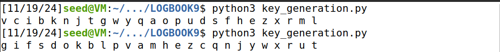
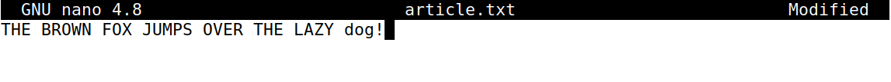
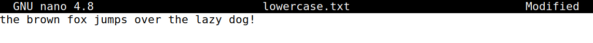
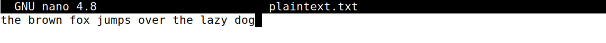
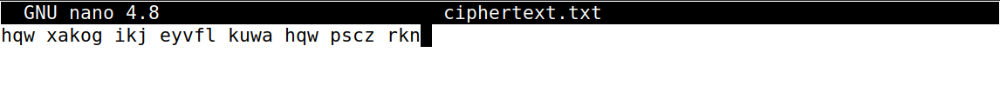
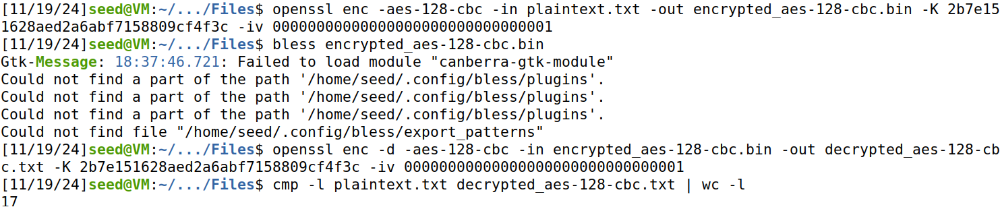
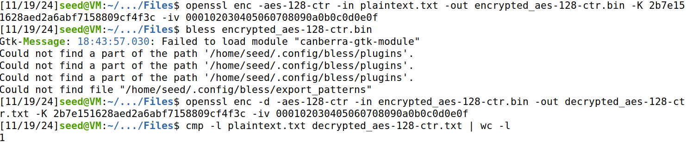

# Trabalho realizado na Semana #9

## Tarefa 1

### Primeiro Passo

Nesta secção é nos dado um _script_ de python que vai gerar uma chave de encriptação randomizada, fazendo qualquer letra do alfabeto corresponder a outra letra.

```python
#!/bin/env python3
import random

s = "abcdefghijklmnopqrstuvwxyz"
list = random.sample(s, len(s))
key = ' '.join(list)
print(key)
```

Aqui temos um exemplo da geração de uma chave:



### Segundo Passo

Agora é nos mostrado como funciona o comando `tr`. Este é capaz de substituir num ficheiro as letras maiúsculas pelas minúsculas.

Sendo assim, vamos confirmar a vericidade desta afirmação.

Criação do ficheiro article:



Execução do comando `tr [:upper:] [:lower:] < article.txt > lowercase.txt` e o seu resultado: 



Para além disso executamos o comando `tr -cd ’[a-z][\n][:space:]’ < lowercase.txt > plaintext.txt`, que vai gerar um novo ficheiro com todos os números e pontuações (!,´, + e etc ...).

Ficheiro atualizado:



### Terceiro Passo

Por fim é executado o comando `$ tr 'abcdefghijklmnopqrstuvwxyz' 'sxtrwinqbedpvgkfmalhyuojzc' \ < plaintext.txt > ciphertext.txt` que, irá encriptar apenas os caracteres do ficheiro de texto.

Ficheiro Final:




### Descobrir a chave de encriptação

Após sabermos como funciona o processo de encriptação, o nosso objectivo será tentar descobrir a mensagem inicial que um ficheiro de texto continha e a chave utilizada no processo de encriptação.

Sendo assim, é nos fornecido um ficheiro de python que capta as várias frequências das letras do novo ficheiro `ciphertext.txt`.

Ficheiro original:

[Ficheiro Encriptado](resources/LOGBOOK9/secret_message.txt)

Sendo assim, primeiramente, visualizamos as letras mais comuns e as suas respectivas palavras. Em Inglês, as palavras mais utilizadas de três caracters são `THE` e `AND`. Como tal, ao substituir cada uma destas pelas letras sifradas, `ytn: 78 ocurrências` e `vup: 30 ocurrências`, verificamos que se encaixam no texto. A partir deste ponto, fomos analisando algumas palavras que fossem faceis de advinhar com a informação atual. Por exemplo, `AeeAhENT` é a palavra `APPARENT` porque, como uma letra equivale sempre ao mesmo caracter, então `ee` teem de ser iguais, demonstrando-se assim equivalente a `P`. Para além disso, `h` estava encriptado através do `R`.
Ao fazer este processo para a frente e para trás, conseguimos captar a **chave de encriptação** e o seu **texto secreto**.

Alfabeto : `abcdefghijklmnopqrstuvwyxz` - relacionado à chave -
`CFMYPVBRLQXWIEJDSGKHNAZTOU`


Mensagem secreta após correr `tr 'abcdefghijklmnopqrstuvwyxz' 'CFMYPVBRLQXWIEJDSGKHNAZTOU' < ciphertext.txt > out.txt`:

[Ficheiro Desencriptado](resources/LOGBOOK9/secret_message.txt)

## Tarefa 2

### Cifra aes-128-ecb

Comando a ser executado para cifrar um `ficheiro txt` através do método `aes-128-ecb`:

```bash
$ openssl enc -aes-128-ecb -in plaintext.txt -out encrypted_aes-128-ecb.bin -K 2b7e151628aed2a6abf7158809cf4f3c
```

**Ao cifrar, que flags teve que especificar?** - Tivemos que especificar a flag `-aes-128-ecb`, sendo esta o tipo de encriptação, a `-in` que especifica o ficheiro a ser encriptado, a `-out` que especifica o ficheiro com a _payload_ encriptada e `-K` com 16 bytes de argumento, ou seja 128 bits, visto que neste modo a chave tem de ter esse tamanho.

Comando a ser executado para decifrar um `ficheiro de texto` através do método `aes-128-ecb`:

```bash
$ openssl enc -d -aes-128-ecb -in encrypted_aes-128-ecb.bin -out decrypted_aes-128-ecb.txt -K 2b7e151628aed2a6abf7158809cf4f3c
$ cmp -l plaintext.txt decrypted_aes-128-cbc.txt | wc -l # verificar o número de bytes diferentes
```

**Ao decifrar, que flags teve que especificar?** - Tivemos que especificar a flag `-d`, para indicar que estamos a desencriptar, para além disso, utilizamos a flag `-aes-128-ecb` ,sendo esta o tipo de encriptação, a `-in` que especifica o ficheiro a ser desencriptado, a `-out` que especifica o ficheiro com a _payload_ desencriptada e `-K` com 16 bytes de argumento, ou seja 128 bits, visto que neste modo a chave tem de ter esse tamanho.


### Cifra aes-128-cbc

Comando a ser executado para cifrar um `ficheiro txt` através do método `aes-128-cbc`:

```bash
$ openssl enc -aes-128-cbc -in plaintext.txt -out encrypted_aes-128-cbc.bin -K 2b7e151628aed2a6abf7158809cf4f3c -iv 00000000000000000000000000000001
```

**Ao cifrar, que flags teve que especificar?** - Tivemos que especificar a flag `-aes-128-cbc`, sendo esta o tipo de encriptação, a `-in` que especifica o ficheiro a ser encriptado, a `-out` que especifica o ficheiro com a _payload_ encriptada, a flag `-K` com 16 bytes de argumento, ou seja 128 bits, visto que neste modo a chave tem de ter esse tamanho e `-iv` que também tem de ter 16 bytes no seu argumento.
A utilização de `-iv` e `-K` serve para habilitar a utilização da mesma chave para diferentes _payloads_, mas com diferentes vetores de inicialização o que habilita várias encriptações com a mesma _data_.  


Comando a ser executado para decifrar um `ficheiro de texto` através do método `aes-128-cbc`:

```bash
$ openssl enc -d -aes-128-cbc -in encrypted_aes-128-cbc.bin -out decrypted_aes-128-cbc.txt -K 2b7e151628aed2a6abf7158809cf4f3c -iv 00000000000000000000000000000001
$ cmp -l plaintext.txt decrypted_aes-128-cbc.txt | wc -l # verificar o número de bytes diferentes
```

**Ao decifrar, que flags teve que especificar?** - Tivemos que especificar a flag `-d`, para indicar que estamos a desencriptar, para além disso, utilizamos a flag `-aes-128-ecb` ,sendo esta o tipo de encriptação, a `-in` que especifica o ficheiro a ser desencriptado, a `-out` que especifica o ficheiro com a _payload_ desencriptada, a flag `-K` com 16 bytes de argumento, ou seja 128 bits, visto que neste modo a chave tem de ter esse tamanho e `-iv` que também tem de ter 16 bytes no seu argumento.

### Cifra aes-128-ctr

Comando a ser executado para cifrar um `ficheiro txt` através do método `aes-128-ctr`:

```bash
$ openssl enc -aes-128-ctr -in plaintext.txt -out encrypted_aes-128-ctr.bin -K 2b7e151628aed2a6abf7158809cf4f3c -iv 000102030405060708090a0b0c0d0e0f
```

**Ao cifrar, que flags teve que especificar?** - Tivemos que especificar a flag `-aes-128-ctr`, sendo esta o tipo de encriptação, a `-in` que especifica o ficheiro a ser encriptado, a `-out` que especifica o ficheiro com a _payload_ encriptada, a flag `-K` com 16 bytes de argumento, ou seja 128 bits, visto que neste modo a chave tem de ter esse tamanho e `-iv` que também tem de ter 16 bytes no seu argumento.
A utilização de `-iv` e `-K` serve para habilitar a utilização da mesma chave para a mesma payload, mas com diferentes vetores de inicialização o que habilita várias encriptações com a mesma data

Comando a ser executado para decifrar um `ficheiro de texto` através do método `aes-128-ctr`:

```bash
$ openssl enc -d -aes-128-ctr -in encrypted_aes-128-ctr.bin -out decrypted_aes-128-ctr.txt -K 2b7e151628aed2a6abf7158809cf4f3c -iv 000102030405060708090a0b0c0d0e0f
$ cmp -l plaintext.txt decrypted_aes-128-cbc.txt | wc -l # verificar o número de bytes diferentes
```

**Ao decifrar, que flags teve que especificar?** - Tivemos que especificar a flag `-d`, para indicar que estamos a desencriptar, para além disso, utilizamos a flag `-aes-128-ctr` ,sendo esta o tipo de encriptação, a `-in` que especifica o ficheiro a ser desencriptado, a `-out` que especifica o ficheiro com a _payload_ desencriptada, a flag `-K` com 16 bytes de argumento, ou seja 128 bits, visto que neste modo a chave tem de ter esse tamanho e `-iv` que também tem de ter 16 bytes no seu argumento.

### Questões finais

**Qual a diferença entre estes diversos modos?** -
O `AES-128-ECB` é o modo mais simples, mas vulnerável a padrões no texto cifrado, pois cada bloco é encriptado de forma independente. O `AES-128-CBC` utiliza um `IV` (vetor de inicialização) para encadear blocos de texto cifrado, oferecendo mais segurança, mas o `IV` precisa ser único para evitar vulnerabilidades. O `AES-128-CTR` é um modo de fluxo que usa um contador como `IV`, permitindo a encriptação paralela e sendo mais eficiente, ideal para streams de dados.


**Qual a diferença principal entre aes-128-ctr e os restantes modos?**-

A principal diferença do `AES-128-CTR` em relação aos restantes modos, como o `AES-128-ECB` e o `AES-128-CBC`, é que o `AES-128-CTR` é um modo de encriptação de fluxo, enquanto os outros são modos de bloco. 
No `AES-128-CTR`, a encriptação é realizada com base em um contador (IV), o que permite que o processo seja feito em paralelo.

## Tarefa 5

Nesta tarefa é nos pedida a alteração do byte `50*G` sendo G o número do nosso grupo.
Sendo assim, temos de alterar o byte 100 pois `G=02`.

Após ter alterado todos os ficheiros binários encriptados, substituindo o byte 100 para um valor diferente, verificamos que para o modo **aes-128-ecb**, como este é baseado na encriptação por blocos, ao alterar o byte 100, o sétimo bloco será alterado. Neste caso teremos `16 bytes` de informação perdida.



Para o modo **aes-128-cbc**, os bytes afetados serão `17` visto que afetará um bloco completo e um byte do próximo bloco.



Para o modo **aes-128-ctr**, ao corromper `um byte` no criptograma, somente aquele `byte` será afetado na decifração, sem causar impacto nos outros blocos, pois cada bloco de texto cifrado é baseado em um contador único que é independente dos blocos anteriores.

