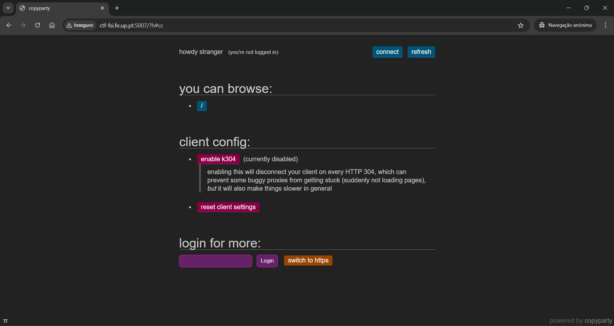
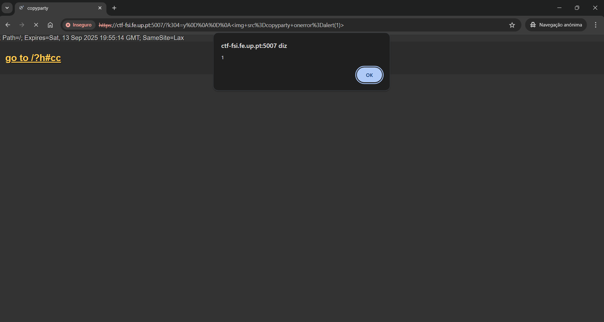
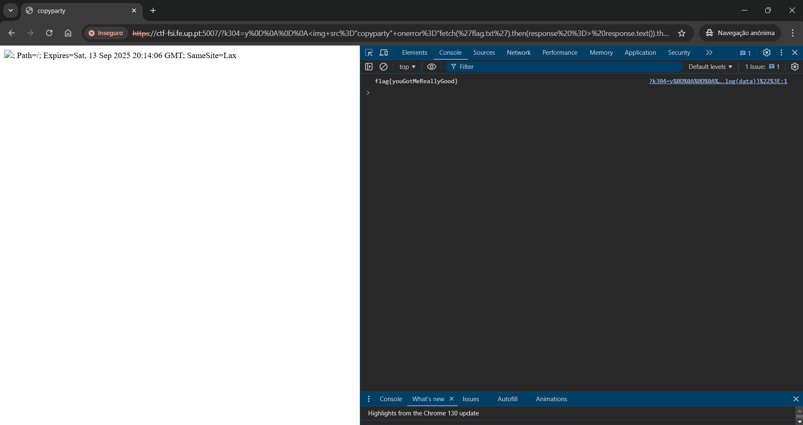

# CTF Semana 7 (XSS)

## Contextualização

O desafio consiste em localizar uma flag num servidor, mas o acesso direto a esta está restrito. A dica fornecida sugere a utilização de um ataque `XSS` (Cross-Site Scripting), executado diretamente no browser do atacante.

## Tarefas

Após compreender o objectivo do CTF, vamos de encontro a algumas questões importantes acerca do servidor vulnerável:

**Porque é que não consegues aceder diretamente à flag secreta?** - O acesso ao conteúdo secreto do ficheiro `flag.txt` não é permitido, uma vez que não estamos `logados` ou existe uma verificação que impede utilizadores sem as permissões necessárias. Como tal, ao abrirmos o ficheiro deparamo-nos com a seguinte mensagem: `Nice try, I am only accessible via JavaScript shenanigans.`.

**Este serviço é popular, até pode ser que tenha vulnerabilidades conhecidas. Será que podem ajudar a que acedas à flag?** - Após a pesquisa de vulnerabilidades relacionadas ao serviço `copyparty`, utilizando um ataque de `XSS`, deparamo-nos com o [CVE-2023-38501](https://www.exploit-db.com/exploits/51635) que se verifica relacionado com a mesma página, [copyparty-github](https://github.com/9001/copyparty), mencionada pelo servidor.

**Qual é o tipo da vulnerabilidade de XSS (Reflected, Stored ou DOM) que te permitiu aceder à flag?** - O tipo de vulnerabilidade de `XSS` que possibilitou a execução do exploit foi o `Reflected`. Isto deve-se ao facto de, ao injetarmos código de JavaScript malicioso através do URL do servidor, este é automaticamente executado mal abrimos esse link, e, por fim, refletido de volta para o utilizador.

## Reconhecimento do Servidor

Seguindo o exploit através da informação do  [CVE-2023-38501](https://www.exploit-db.com/exploits/51635), sabemos que se utilizarmos o parâmetro `k304`, podemos inserir código de JavaScript malicioso pretendido.

Sendo assim, após percorrer o servidor em pormenor, deparamo-nos com a seguinte página:

É a partir daqui que nós conseguimos tornar o _exploit_ possível, uma vez que conseguimos disponibilizar a utilização do `k304`. Para além disso, temos de mudar para o servidor em `HTTPS`, visto que, ao ativarmos o parâmetro `k304` torna-se ímpossivel a navegação na _webpage_.

## Execução do Exploit

Para executarmos o exploit, primeiro temos de perceber como funciona o o parâmetro `k304`, que vai ser passado no _URL_ do servidor.

Na página do CVE obtido, é nos dado um exemplo para testarmos a vericidade da vulnerabilidade encontrada.

Sendo assim, inserimos no nosso _URL_ base, `https://ctf-fsi.fe.up.pt:5007/`, o seguinte `?k304=y%0D%0A%0D%0A%3Cimg+src%3Dcopyparty+onerror%3Dalert(1)%3E` e ficamos com algo deste género: `https://ctf-fsi.fe.up.pt:5007/?k304=y%0D%0A%0D%0A%3Cimg+src%3Dcopyparty+onerror%3Dalert(1)%3E`

Ao inserirmos no servidor:

Como tal, verificamos que realmente é possível correr o nosso script malicioso através do _URL_ do servidor.

Sendo assim, agora o nosso objectivo é arranjar alguma maneira de ler o ficheiro `flag.txt`. Para tal, decidimos fazer um _HTTP_ request do ficheiro e dar _print_ da payload desse mesmo na consola.

Não podemos esquecer que o _URL_ deve ser codificado, substituindo os caracters `<`, `>`, `=` e etc... pelos seus respetivos códigos.

Link criado - `https://ctf-fsi.fe.up.pt:5007/?k304=y%0D%0A%0D%0A%3Cimg+src%3D%22copyparty%22+onerror%3D%22fetch('flag.txt').then(response%20%3D%3E%20response.text()).then(data%20%3D%3E%20console.log(data))%22%3E`

Execução do _script_:

Como podemos ver conseguimos obter a flag, `flag{youGotMeReallyGood}`, demonstrando a eficácia do nosso _script_.