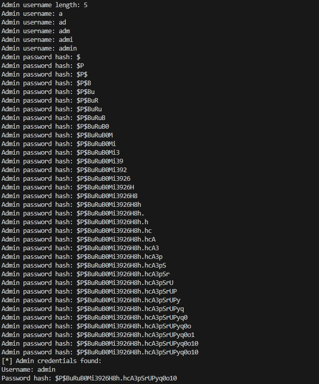
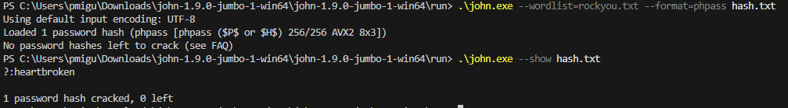

# CTF Semana 8 (SQL Injection)

## Contextualização

O desafio consiste em identificar endpoints na API do site que consigam executar _queries_ à base de dados, através do input do utilizador, sendo o objectivo tirar proveito desta vunerabilidade e conseguir concretizar um ataque malicioso.

## Tarefas

**Quais as versões de software instalado no site do WordPress**: Através da inspeção da página encontramos a `versão do WordPress`, sendo esta a `6.7.1`, e também fomos à procura dos seus _plugins_, tendo encontrado o `notificationx` com a `versão 2.8.1`.

**Existem vulnerabilidades que permitem automatizar a descoberta e abuso de vulnerabilidades de SQL injection?**: Sim, após termos identificado as respetivas versões de cada componente anteriormente referida, fomos à procura do `CVE` que mais se encaixava com os nossos requerimentos. Sendo assim, após procurarmos no _search engine_ do [Mitre](https://cve.mitre.org/), `(WordPress 6.7.1) && (notificationx 2.8.1) && (Sql Injection)`, chegamos à conclusão que de entre os 4 resultados da pesquisa, o [CVE-2024-1698](https://www.cve.org/CVERecord?id=CVE-2024-1698) era o que procuravamos.

**Qual o endpoint do site vulnerável, e de que forma se pode realizar um ataque? Como pode ser catalogada a vulnerabilidade?**: Neste caso, o endpoint vulnerável do site é `http://44.242.216.18:5008/wp-json/notificationx/v1/analytics`. Conseguimos executar um ataque a este _endpoint_, através do nosso `script de python`, que faz _queries_ de SQL maliciosas com a função `SLEEP()` para medir atrasos no servidor, de forma a termos acesso a informação privada, sendo neste caso a `password` do utilizador `admin`. Esta vulnerabilidade é referida como `Time-based Blind SQL Injection`.

**Para este servidor, e em mais detalhe, qual a política de armazenamento de palavras-passe?**: Neste servidor, a partir da hash gerada, `$P$BuRuB0Mi3926H8h.hcA3pSrUPyq0o10`, podemos deduzir que a política de armazenamento utilizada é o algoritmo `phpBB`. Este consiste na utilização de um `salt aleatório`, juntamente com a password _hashed_. Este algoritmo é vulnerável a ataques de _brute force_ e a utilização de `dicionários/wordlists`.  

**Será que armazenar uma hash da palavra-passe é seguro, no sentido em que torna impossível a recuperação da palavra-passe original?**: Não, como já referido anteriormente, mesmo que a password esteja _hashed_ é possível conseguirmos acertar a palavra-passe. Realisticamente o método _brute force_ provavelmente seria muito demoroso, sendo a utilização de uma _wordlist_ mais prática.

## Execução do Exploit

Após termos respondido às questões anteriores, vamos demonstrar a execução deste exploit.

De forma a conseguirmos a _password hashed_ do admin, nós executamos o _script_ de python que se encontra no repositório [CVE-2024-1698-Exploit](https://github.com/kamranhasan/CVE-2024-1698-Exploit), substituindo a variável do _endpoint_ **vulnerável pelo do nosso website** e modificando o **delay da função sleep para 1 segundo**.

Execução do script:

Resultado do script: `$P$BuRuB0Mi3926H8h.hcA3pSrUPyq0o10`

Possuindo a _password hashed_ do admin, apenas temos de desencriptá-la. Para tal, utilizaremos a ferramenta **john the ripper**, programa que se especializa na desencriptação de palavras-passe. 
Para além disso, a utilização de uma wordlist será necessária, visto que, a utilização do método _brute force_ como pode ser rápida, como pode demorar milhões de anos.

Sendo assim, fomos buscar uma das _wordlists_ mais conhecidas, a `rockyou.txt` e executamos com o ficheiro `hash.txt` onde guardamos a _hash_ da _password_ do _admin_.

Execução do programa:

Como podemos ver, executamos com sucesso o exploit, obtendo a palavra-passe do admin, sendo esta `heartbroken`. Sendo assim obtemos a flag: `flag{heartbroken}`.
